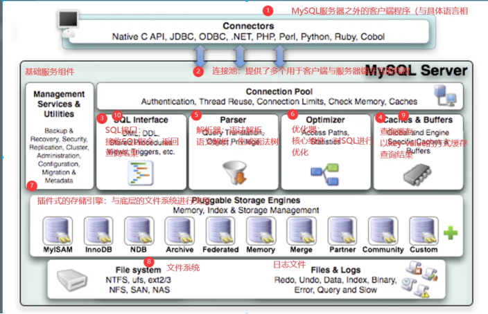
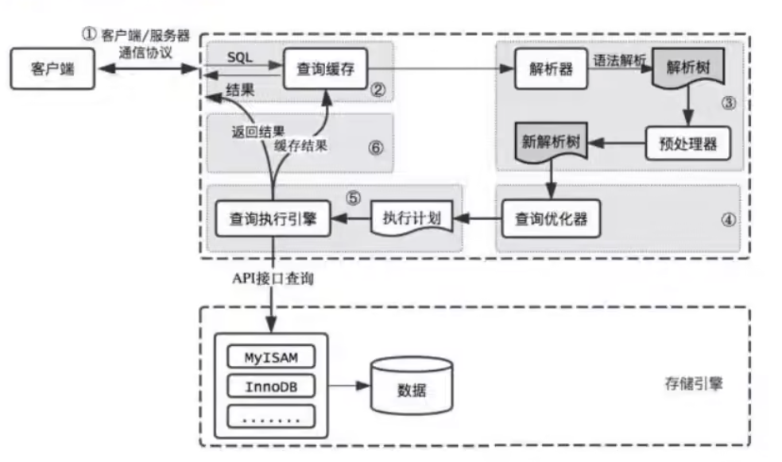
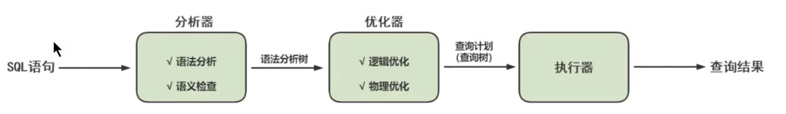

## 逻辑架构



## SQL 执行流程





## MySQL 8 中 SQL 执行原理

```sql
-- 确认 profiling 是否开启
-- select @@profiling;

-- 开启 profiling
SET @@profiling = 1;

SELECT  * FROM employees;
SELECT  * FROM employees;
SHOW profiles;
/*
+----------+------------+--------------------------+
| Query_ID | Duration   | Query                    |
+----------+------------+--------------------------+
|        1 | 0.00054075 | SELECT  * FROM employees |
|        2 | 0.00060700 | SELECT  * FROM employees |
+----------+------------+--------------------------+
*/

SHOW profile FOR QUERY 2;
/*
+--------------------------------+----------+
| Status                         | Duration |
+--------------------------------+----------+
| starting                       | 0.000086 |
| Executing hook on transaction  | 0.000009 |
| starting                       | 0.000012 |
| checking permissions           | 0.000011 |
| Opening tables                 | 0.000051 |
| init                           | 0.000008 |
| System lock                    | 0.000009 |
| optimizing                     | 0.000005 |
| statistics                     | 0.000018 |
| preparing                      | 0.000017 |
| executing                      | 0.000314 |
| end                            | 0.000008 |
| query end                      | 0.000003 |
| waiting for handler commit     | 0.000010 |
| closing tables                 | 0.000008 |
| freeing items                  | 0.000021 |
| cleaning up                    | 0.000019 |
+--------------------------------+----------+
*/

SHOW profile FOR QUERY 1;
/*
+--------------------------------+----------+
| Status                         | Duration |
+--------------------------------+----------+
| starting                       | 0.000111 |
| Executing hook on transaction  | 0.000009 |
| starting                       | 0.000010 |
| checking permissions           | 0.000007 |
| Opening tables                 | 0.000038 |
| init                           | 0.000006 |
| System lock                    | 0.000009 |
| optimizing                     | 0.000005 |
| statistics                     | 0.000031 |
| preparing                      | 0.000028 |
| executing                      | 0.000234 |
| end                            | 0.000008 |
| query end                      | 0.000003 |
| waiting for handler commit     | 0.000010 |
| closing tables                 | 0.000008 |
| freeing items                  | 0.000015 |
| cleaning up                    | 0.000012 |
+--------------------------------+----------+
*/
```

## MySQL 5.7 中 SQL 执行原理

开启 `query_cache_type`

```ini
[mysqld]
query_cache_type = 1
```

```sql
-- 开启 profiling
SET @@profiling = 1;

SELECT  * FROM employees;
SELECT  * FROM employees;
SHOW profiles;
/*
+----------+------------+--------------------------+
| Query_ID | Duration   | Query                    |
+----------+------------+--------------------------+
|        1 | 0.00057175 | SELECT  * FROM employees |
|        2 | 0.00009750 | SELECT  * FROM employees |
+----------+------------+--------------------------+
*/

 show profile FOR QUERY 1;
/*
+--------------------------------+----------+
| Status                         | Duration |
+--------------------------------+----------+
| starting                       | 0.000046 |
| Waiting for query cache lock   | 0.000007 |
| starting                       | 0.000002 |
| checking query cache for query | 0.000061 |
| checking permissions           | 0.000023 |
| Opening tables                 | 0.000024 |
| init                           | 0.000030 |
| System lock                    | 0.000011 |
| Waiting for query cache lock   | 0.000002 |
| System lock                    | 0.000020 |
| optimizing                     | 0.000003 |
| statistics                     | 0.000012 |
| preparing                      | 0.000009 |
| executing                      | 0.000002 |
| Sending data                   | 0.000243 |
| end                            | 0.000009 |
| query end                      | 0.000010 |
| closing tables                 | 0.000008 |
| freeing items                  | 0.000006 |
| Waiting for query cache lock   | 0.000002 |
| freeing items                  | 0.000022 |
| Waiting for query cache lock   | 0.000002 |
| freeing items                  | 0.000002 |
| storing result in query cache  | 0.000003 |
| cleaning up                    | 0.000015 |
+--------------------------------+----------+
*/

show profile FOR QUERY 2;
/*
+--------------------------------+----------+
| Status                         | Duration |
+--------------------------------+----------+
| starting                       | 0.000035 |
| Waiting for query cache lock   | 0.000009 |
| starting                       | 0.000003 |
| checking query cache for query | 0.000009 |
| checking privileges on cached  | 0.000006 |
| checking permissions           | 0.000015 |
| sending cached result to clien | 0.000016 |
| cleaning up                    | 0.000005 |
+--------------------------------+----------+
*/
```

