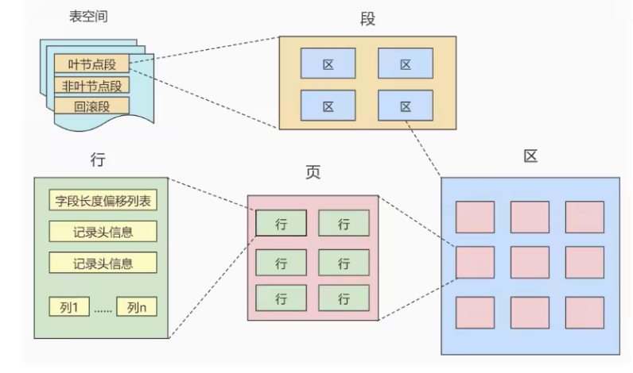
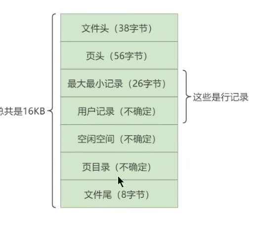
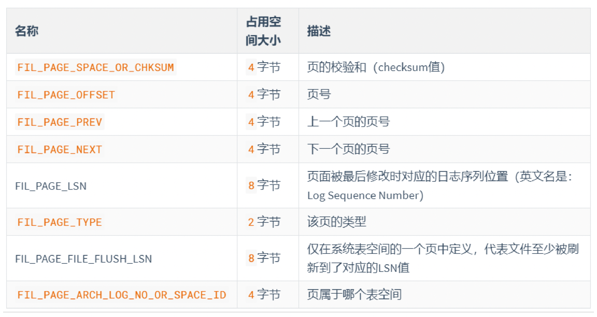

## 磁盘与内存交互基本单位：页

InnoDB将数据划分为若干个`页`，`页`的大小默认为`16KB`。

```sql
-- 查看页大小
SHOW VARIABLES LIKE 'innodb_page_size';
/*
+------------------+-------+
| Variable_name    | Value |
+------------------+-------+
| innodb_page_size | 16384 |
+------------------+-------+
*/
```

以`页`作为磁盘和内存之间交互的基本单位，也就是说一次最少从磁盘中读取16KB的内容到内存中，一次最少把内存中的16KB内容刷新到磁盘中。也就是说，**在数据库中，无论读一行还是多行，都是将其所在的`页`进行加载。也就是说，数据库管理存储空间的单位是`页`(`Page`)，数据库I/O操作的最小单位是`页`**

> 记录是按照行来存储的，但数据库读取并不是以行为单位，否则一次读取（也就是一次I/O操作）只能处理一行数据，效率会非常低。

多`页`之间可以不在物理结构上相连，只要通过**双向链表**相关联即可。每个数据页中的记录会按照主键值从小到大的顺序组成一个**单向链表**，每个数据页都会为存储在它里面的记录生成一个**页目录**，通过主键查找某条记录的时候，可以在页目录中使用**二分法**快速定位到对应的槽，然后再遍历该槽对应分组中的记录即可快速找到指定的记录。

页的上层概念：



- `区(Extent)`：比页大一级的存储结构，在 InnoDB 存储引擎中，一个区会分配`64`个**连续的**页。所以一个区的大小是 `64 * 16KB = 1MB`
- `段(Segment)`：由一个式多个区组成，区在文件系统是一个连续分配的空间（64个连续的页），但在段中不要求区与区之间是相邻的。**段是数据库中的`分配单位`，不同类型的数据库对象以不同的段形式存在。**
- `表空间(Tablespace)`：是一个逻辑容器，表空间存储的对象是段，在一个表空间中可以有一个或多个段，但是一个段只能属于一个表空间。数据库由一个或多个表空间组成，表空间从管理上可以划分为系统表空间、用户表空间、撤销表空间、临时表空间等。

## 页的内部结构

如果按类型划分的话，常见的有`数据页（保存B+树节点）`、`系统页`、`Undo页`和`事务数据页`等。

数据页的16K大小的存储空间被划分为7个部分：




### 文件头(File Header)和文件尾(File Trailer)

#### 文件头

页的第一个组成部分，它描述了一些针对各种页都能用的信息。比如页的编号、它的上一页、下一页等。它占用38字节：


