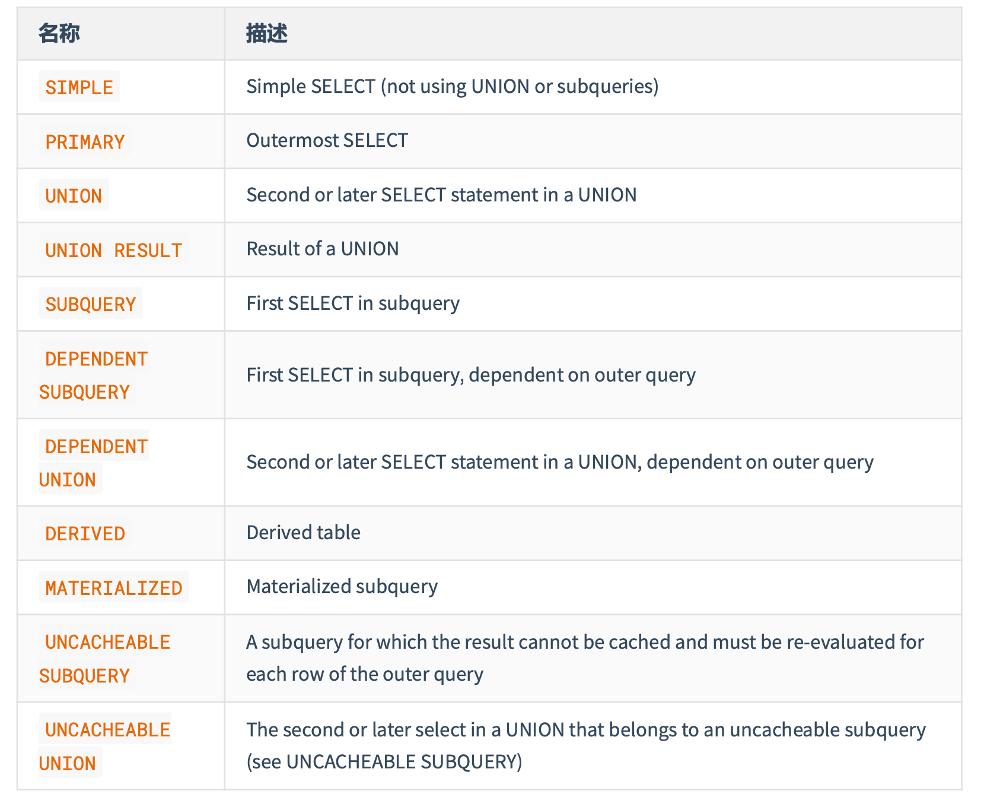
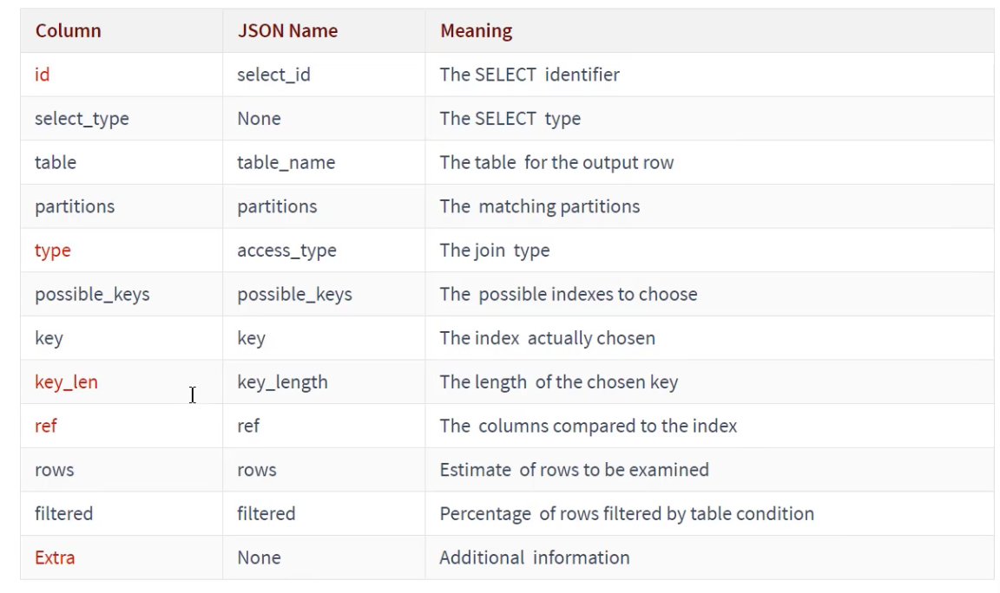
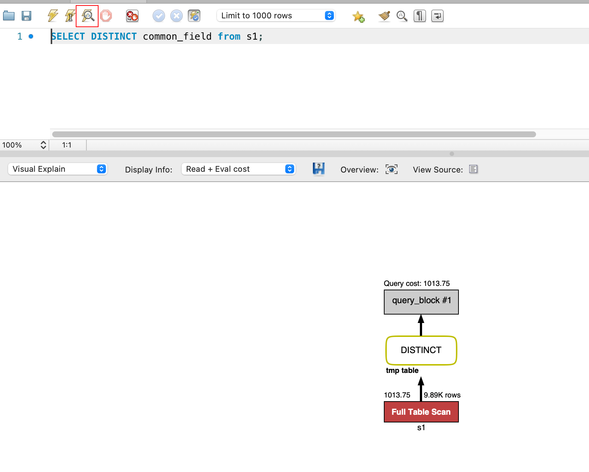
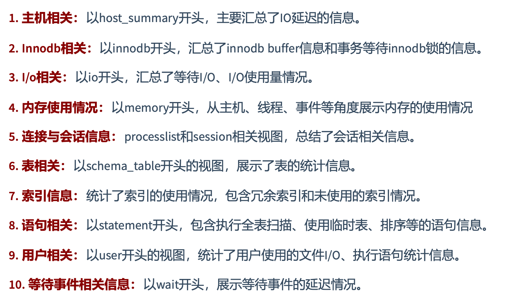

## 查看系统性能参数

```sql
SHOW [GLOBAL|SESSION] STATUS LIKE 参数;
```

一些常用的性能参数：

- `Connections`：连接MySql服务器的次数
- `Uptime`：Mysql服务器的上线时间
- `Slow_queries`：慢查询次数
- `Innodb_rows_read`：Select 查询返回的行数
- `Innodb_rows_inserted`：执行INSERT操作插入的行数
- `Innodb_rows_updated`：执行UPDATE操作更新的行数
- `Innodb_rows_deleted`：执行DELETE操作删除的行数
- `Com_select`：查询操作的次数
- `Com_insert`：插入操作的次数。对于批量插入的INSERT操作，只累加一次
- `Com_update`：更新操作的次数
- `Com_delete`：删除操作的次数

## 统计 SQL 的查询成本

> 其值为SQL语句所需要读取的数据页的数量

```sql
SHOW STATUS LIKE 'last_query_cost';
```

举例：

```sql
select * from student_info where id=909099;
show status like 'last_query_cost';
/*
+-----------------+----------+
| Variable_name   | Value    |
+-----------------+----------+
| Last_query_cost | 1.000000 |
+-----------------+----------+
*/

select * from student_info where id BETWEEN 909099 AND 909199;
/*
+-----------------+-----------+
| Variable_name   | Value     |
+-----------------+-----------+
| Last_query_cost | 20.491068 |
+-----------------+-----------+
*/

select * from student_info where name like 'a%';
show status like 'last_query_cost';
/*
+-----------------+---------------+
| Variable_name   | Value         |
+-----------------+---------------+
| Last_query_cost | 100501.749000 |
+-----------------+---------------+
*/

CREATE INDEX idx_student_name ON student_info(name);
select * from student_info where name like 'a%';
show status like 'last_query_cost';
/*
+-----------------+--------------+
| Variable_name   | Value        |
+-----------------+--------------+
| Last_query_cost | 35767.159000 |
+-----------------+--------------+
*/
```

使用场景：它对于比较开销是非常有用的，特别是我们有好几种查询方式可选的时候。

> SQL 查询是一个动态的过程，从页加载的角度来看，可以得到以下结论：
>
> - **位置决定效率**。如果页就在数据库缓冲池中，那么效率是最高的，否则还需要从内存或磁盘中进行读取，当然针对单个页的读取来说，如果页存在于内存中，会比在磁盘中读取效率高很多。
> - **批量决定效率**。如果我们从磁盘中对单一页进行随机读，那么效率是很低的（差不多10ms），而采用顺序读取方式，批量对页进行读取，平均一页的读取效率就会提升很多，甚至要快于单个页在内存中的随机读取

## 定位执行慢的 SQL：慢查询日志

> 如果不是调优需要的话，一般不建议启动该功能

### 开启慢查询日志

```sql
-- 查看是否开启慢查询日志
SHOW VARIABLES LIKE '%slow_query_log';

-- 开启慢查询日志
SET GLOBAL slow_query_log='ON';

-- 查看是否开启慢查询日志以及日志文件路径
SHOW VARIABLES LIKE '%slow_query_log%';
```

### 设置响应时间阈值

```sql
-- 查看响应时间阈值(默认10秒)
SHOW [GLOBAL | SESSION] VARIABLES LIKE '%long_query_time%';

-- 设置响应时间阈值为1秒
SET GLOBAL long_query_time=1;
SET SESSION long_query_time=1;
```

### 配置文件

```ini
[mysqld]
slow_query_log=ON
slow_query_log_file=/var/lib/mysql/主机名-slow.log
long_query_time=1
log_output=FILE
```

### 查看慢查询数目

> 除了上述变量，控制慢查询日志的还有一个 `min_examined_row_limit` 系统变量(默认值为`0`)。其含义是查询**扫描过的最少记录数**。它和`long_query_time`共同组成了判别一个查询是否是慢查询的条件。如果查询扫描过的记录数大于等于这个变量的值，并且查询执行时间超过了 `long_query_time` 的值，那么这个查询就会被记录到查询日志中。

```sql
-- 当前系统有多少条慢查询记录
SHOW GLOBAL STATUS LIKE '%Slow_queries%';
```

## 慢查询日志分析工具 `mysqldumpslow`

```bash
mysqldumpslow -s t -t 5 /var/lib/mysql/bc461f9ffb85-slow.log

#Count: 1  Time=1.76s (1s)  Lock=0.00s (0s)  Rows=3.0 (3), root[root]@localhost
#  SELECT * from student_info WHERE name='S'
```

- `-s t`：按 SQL 执行时间排序
- `-t 5`：返回前5条日志
- `/var/lib/mysql/bc461f9ffb85-slow.log`：慢查询日志文件路径

 ##  关闭慢查询日志

```sql
SET GLOBAL slow_query_log='OFF';
```

## 删除慢查询日志文件

```bash
rm -rf /var/lib/mysql/bc461f9ffb85-slow.log && \
mysqladmin -u root -p flush-logs slow # 重新生成查询日志文件
```

## 查看 SQL 执行成本 `SHOW PROFILE`

```sql
-- 查看开启状态
SHOW VARIABLES LIKE 'profiling';
-- 开启
SET PROFILING = 'ON';

-- 查看列表
SHOW PROFILES;
/*
+----------+------------+------------------------------------------------+
| Query_ID | Duration   | Query                                          |
+----------+------------+------------------------------------------------+
|        1 | 0.00171800 | SHOW VARIABLES LIKE 'profiling'                |
|        2 | 1.77542975 | SELECT * from student_info WHERE name='lzQDth' |
+----------+------------+------------------------------------------------+
*/
-- 查看成本
SHOW PROFILE [cpu,block io] [FOR QUERY N]; -- N为列表中的序号

show profile cpu,block io for query 2;
/*
+----------------------------+----------+----------+------------+--------------+---------------+
| Status                     | Duration | CPU_user | CPU_system | Block_ops_in | Block_ops_out |
+----------------------------+----------+----------+------------+--------------+---------------+
| starting                   | 0.000092 | 0.000084 |   0.000007 |            0 |             0 |
| checking permissions       | 0.000010 | 0.000009 |   0.000001 |            0 |             0 |
| Opening tables             | 0.000039 | 0.000036 |   0.000003 |            0 |             0 |
| init                       | 0.000006 | 0.000006 |   0.000000 |            0 |             0 |
| System lock                | 0.000008 | 0.000007 |   0.000001 |            0 |             0 |
| optimizing                 | 0.000011 | 0.000010 |   0.000000 |            0 |             0 |
| statistics                 | 0.000063 | 0.000037 |   0.000003 |            0 |             0 |
| preparing                  | 0.000023 | 0.000021 |   0.000002 |            0 |             0 |
| executing                  | 1.775073 | 1.744532 |   0.233335 |            0 |             0 |
| end                        | 0.000021 | 0.000018 |   0.000002 |            0 |             0 |
| query end                  | 0.000005 | 0.000005 |   0.000000 |            0 |             0 |
| waiting for handler commit | 0.000010 | 0.000009 |   0.000001 |            0 |             0 |
| closing tables             | 0.000008 | 0.000007 |   0.000001 |            0 |             0 |
| freeing items              | 0.000048 | 0.000045 |   0.000003 |            0 |             0 |
| cleaning up                | 0.000014 | 0.000012 |   0.000001 |            0 |             0 |
+----------------------------+----------+----------+------------+--------------+---------------+
*/

-- 可以看出，时间都花费在 executing 上，所以可以用 explain 工具分析该SQL语句 
```

常用查询参数：

- `ALL`：显示所有的开销信息
- `BLOCK IO`：显示块IO开销
- `CONTEXT SWITCHES`：上下文切换开销
- `CPU`：显示CPU开销信息
- `IPC`：显示发送和接收开销信息
- `MEMORY`：显示内存开销信息
- `PAGE FAULTS`：显示页面错误的开销信息
- `SOURCE`：显示和 `Source_function`, `Source_file` 和 `Source_line` 相关的开销信息
- `SWAPS`：显示交换次数开销信息

日常开发需要注意的结论：

- `converting HEAP to MyISAM`：查询结果太大，内存不足，数据往磁盘上搬了
- `Creating tmp table`：创建临时表。先拷贝数据到临时表，用完后再删除临时表
- `Coping to tmp table on disk`：把内存中临时表复制到磁盘上，警惕！
- `locked`

如果在 `show profile` 诊断结果中出现了以上4条结果中的任何一条，则 SQL 语句需要优化。

> 注意，`SHOW PROFILE` 命令将被弃用，我们可以从 `infomation_schema.profiling` 表中进行查看。

## 分析查询语句：`EXPLAIN`

定位了慢查询的 SQL 之后，可以使用 `EXPLAIN` 或 `DESCRIBE` 工具做针对性的分析查询语句。这两个工具是一样的。

能做什么？

- 表的读取顺序
- 数据读取操作的操作类型
- 哪些索引可以使用
- **哪些索引被实际使用**
- 表之间的引用
- **每张表有多少行被优化器查询**

> [官方文档](https://dev.mysql.com/doc/refman/8.0/en/explain-output.html)

**`EXPLAIN` 输出的各列的作用**

| 列              | 描述                                                         |
| --------------- | ------------------------------------------------------------ |
| `id`            | 在一个大的查询语句中，每个 `SELECT` 关键字都对应一个**唯一ID** |
| `select_type`   | `SELECT` 关键字对应的那个查询的类型                          |
| `table`         | 表名                                                         |
| `partitions`    | 匹配的分区信息                                               |
| `type` ✨        | 针对单表的访问方法                                           |
| `possible_keys` | 可能用到的索引                                               |
| `key`           | 实际使用的索引                                               |
| `key_len` ✨     | 实际使用到的索引长度                                         |
| `ref`           | 当使用索引列等值查询时，与索引列进行等值匹配的对象信息       |
| `rows` ✨        | 预估的需要读取的记录条数                                     |
| `filtered`      | 某个表经过搜索条件过滤后，剩余记录条数的百分比               |
| `Extra` ✨       | 一些额外信息                                                 |

## EXPLAIN 数据准备

```sql
-- 建表
CREATE TABLE s1(
	id INT AUTO_INCREMENT,
  key1 VARCHAR(100),
  key2 INT,
  key3 VARCHAR(100),
  key_part1 VARCHAR(100),
  key_part2 VARCHAR(100),
  key_part3 VARCHAR(100),
  common_field VARCHAR(100),
  PRIMARY KEY (id),
  INDEX idx_key1(key1),
  UNIQUE INDEX idx_key2(key2),
  INDEX idx_key3(key3),
  INDEX idx_key_part(key_part1, key_part2, key_part3)
);

CREATE TABLE s2(
	id INT AUTO_INCREMENT,
  key1 VARCHAR(100),
  key2 INT,
  key3 VARCHAR(100),
  key_part1 VARCHAR(100),
  key_part2 VARCHAR(100),
  key_part3 VARCHAR(100),
  common_field VARCHAR(100),
  PRIMARY KEY (id),
  INDEX idx_key1(key1),
  UNIQUE INDEX idx_key2(key2),
  INDEX idx_key3(key3),
  INDEX idx_key_part(key_part1, key_part2, key_part3)
);

-- 存储函数
set global log_bin_trust_function_creators=1;

DELIMITER //
CREATE FUNCTION rand_string1(n INT)
RETURNS VARCHAR(255) -- 该函数会返回一个字符串 
BEGIN
    DECLARE chars_str VARCHAR(100) DEFAULT
'abcdefghijklmnopqrstuvwxyzABCDEFJHIJKLMNOPQRSTUVWXYZ';
    DECLARE return_str VARCHAR(255) DEFAULT '';
    DECLARE i INT DEFAULT 0;
    WHILE i < n DO
        SET return_str =CONCAT(return_str,SUBSTRING(chars_str,FLOOR(1+RAND()*52),1));
        SET i = i + 1;
    END WHILE;
    RETURN return_str;
END //
DELIMITER ;


-- 存储过程 insert_s1
DELIMITER //
CREATE PROCEDURE insert_s1 (IN min_num INT (10),IN max_num INT (10))
BEGIN
    DECLARE i INT DEFAULT 0;
    SET autocommit = 0;
    REPEAT
    SET i = i + 1;
    INSERT INTO s1 VALUES(
    (min_num + i),
    rand_string1(6),
    (min_num + 30 * i + 5),
    rand_string1(6),
    rand_string1(10),
    rand_string1(5),
    rand_string1(10),
    rand_string1(10));
    UNTIL i = max_num
END REPEAT;
    COMMIT;
END //
DELIMITER ;

-- 存储过程 insert_s2

DELIMITER //
CREATE PROCEDURE insert_s2 (IN min_num INT (10),IN max_num INT (10))
BEGIN
    DECLARE i INT DEFAULT 0;
    SET autocommit = 0;
    REPEAT
    SET i = i + 1;
    INSERT INTO s2 VALUES(
        (min_num + i),
        rand_string1(6),
        (min_num + 30 * i + 5),
        rand_string1(6),
        rand_string1(10),
        rand_string1(5),
        rand_string1(10),
        rand_string1(10));
    UNTIL i = max_num
    END REPEAT;
    COMMIT;
END //
DELIMITER ;

-- 调用存储过程
CALL insert_s1(10001,10000);
CALL insert_s2(10001,10000);
```

## EXPLAIN 之 `table`

无论我们的查询语句多复杂，其中包含了多少个表，到最后也是需要对每个表进行单表访问的，所以 mysql 规定**EXPLAIN 语句输出的每条记录都对应着某个单表的访问方法**，该条记录的 `table` 列代表着该表的表名（有时不是真实的表名，可能是简称）

```sql
explain select * from s1;
/*
+----+-------------+-------+------------+------+---------------+------+---------+------+------+----------+-------+
| id | select_type | table | partitions | type | possible_keys | key  | key_len | ref  | rows | filtered | Extra |
+----+-------------+-------+------------+------+---------------+------+---------+------+------+----------+-------+
|  1 | SIMPLE      | s1    | NULL       | ALL  | NULL          | NULL | NULL    | NULL | 9895 |   100.00 | NULL  |
+----+-------------+-------+------------+------+---------------+------+---------+------+------+----------+-------+
*/

explain select * from s1 INNER JOIN s2;
/*
+----+-------------+-------+------------+------+---------------+------+---------+------+-------+----------+-------------------------------+
| id | select_type | table | partitions | type | possible_keys | key  | key_len | ref  | rows  | filtered | Extra                         |
+----+-------------+-------+------------+------+---------------+------+---------+------+-------+----------+-------------------------------+
|  1 | SIMPLE      | s1    | NULL       | ALL  | NULL          | NULL | NULL    | NULL |  9895 |   100.00 | NULL                          |
|  1 | SIMPLE      | s2    | NULL       | ALL  | NULL          | NULL | NULL    | NULL | 10152 |   100.00 | Using join buffer (hash join) |
+----+-------------+-------+------------+------+---------------+------+---------+------+-------+----------+-------------------------------+
*/
```

## EXPLAIN 之 `id`

每一个 SELECT 关键字都对应一个唯一的ID

```sql
EXPLAIN SELECT * FROM s1 WHERE key1='a';
/*
+----+-------------+-------+------------+------+---------------+----------+---------+-------+------+----------+-------+
| id | select_type | table | partitions | type | possible_keys | key      | key_len | ref   | rows | filtered | Extra |
+----+-------------+-------+------------+------+---------------+----------+---------+-------+------+----------+-------+
|  1 | SIMPLE      | s1    | NULL       | ref  | idx_key1      | idx_key1 | 403     | const |    1 |   100.00 | NULL  |
+----+-------------+-------+------------+------+---------------+----------+---------+-------+------+----------+-------+
*/

EXPLAIN SELECT * FROM s1 INNER JOIN s2
ON s1.key1 = s2.key1
WHERE s1.common_field = 'a';
/*
+----+-------------+-------+------------+------+---------------+----------+---------+--------------------+------+----------+-------------+
| id | select_type | table | partitions | type | possible_keys | key      | key_len | ref                | rows | filtered | Extra       |
+----+-------------+-------+------------+------+---------------+----------+---------+--------------------+------+----------+-------------+
|  1 | SIMPLE      | s1    | NULL       | ALL  | idx_key1      | NULL     | NULL    | NULL               | 9895 |    10.00 | Using where |
|  1 | SIMPLE      | s2    | NULL       | ref  | idx_key1      | idx_key1 | 403     | atguigudb1.s1.key1 |    1 |   100.00 | NULL        |
+----+-------------+-------+------------+------+---------------+----------+---------+--------------------+------+----------+-------------+
*/

EXPLAIN SELECT * FROM s1 
WHERE key1 IN (SELECT key3 FROM s2);
/*
+----+--------------+-------------+------------+--------+---------------------+---------------------+---------+--------------------+-------+----------+-------------+
| id | select_type  | table       | partitions | type   | possible_keys       | key                 | key_len | ref                | rows  | filtered | Extra       |
+----+--------------+-------------+------------+--------+---------------------+---------------------+---------+--------------------+-------+----------+-------------+
|  1 | SIMPLE       | s1          | NULL       | ALL    | idx_key1            | NULL                | NULL    | NULL               |  9895 |   100.00 | Using where |
|  1 | SIMPLE       | <subquery2> | NULL       | eq_ref | <auto_distinct_key> | <auto_distinct_key> | 403     | atguigudb1.s1.key1 |     1 |   100.00 | NULL        |
|  2 | MATERIALIZED | s2          | NULL       | index  | idx_key3            | idx_key3            | 403     | NULL               | 10152 |   100.00 | Using index |
+----+--------------+-------------+------------+--------+---------------------+---------------------+---------+--------------------+-------+----------+-------------+
*/

EXPLAIN SELECT  * FROM s1 UNION SELECT * FROM s2;
/*
+----+--------------+------------+------------+------+---------------+------+---------+------+-------+----------+-----------------+
| id | select_type  | table      | partitions | type | possible_keys | key  | key_len | ref  | rows  | filtered | Extra           |
+----+--------------+------------+------------+------+---------------+------+---------+------+-------+----------+-----------------+
|  1 | PRIMARY      | s1         | NULL       | ALL  | NULL          | NULL | NULL    | NULL |  9895 |   100.00 | NULL            |
|  2 | UNION        | s2         | NULL       | ALL  | NULL          | NULL | NULL    | NULL | 10152 |   100.00 | NULL            |
| NULL | UNION RESULT | <union1,2> | NULL       | ALL  | NULL          | NULL | NULL    | NULL |  NULL |     NULL | Using temporary |
+----+--------------+------------+------------+------+---------------+------+---------+------+-------+----------+-----------------+
*/
```

- `id` 如果相同，可认为是一组，从上往下顺序执行
- 在所有组中，`id` 值越大，优先级越高，越先执行
- 关注点：`id`号每个号码表示一趟独立的查询，一个SQL查询的趟次越少越好

## EXPLAIN 之 `select_type` 

SELECT 关键字对应的那个查询的类型，确定小查询在整个大查询中扮演的角色。



- 查询语句中不包含`UNION`或子查询的，都是 `SIMPLE`，连接查询也是 `SIMPLE` 类型

- 对于包含 `UNION [ALL]` 或者子查询的大查询来说：

  - 最左边的查询就是 `PRIMARY`
  - 其余小查询就是 `UNION`
  - MySQL 选择使用临时表来完成 `UNION` 的去重，该临时表就是 `UNION RESULT`

- 如果包含子查询的语句不能转换为对应的 `semi-join` 的形式，并且该子查询不是相关子查询，该子查询第一个`SELECT`就是`SUBQUERY`

  ```sql
  EXPLAIN SELECT  * FROM s1 WHERE key1 IN (SELECT key1 FROM s2) OR key3 = 'a';
  /*
  +----+-------------+-------+------------+-------+---------------+----------+---------+------+-------+----------+-------------+
  | id | select_type | table | partitions | type  | possible_keys | key      | key_len | ref  | rows  | filtered | Extra       |
  +----+-------------+-------+------------+-------+---------------+----------+---------+------+-------+----------+-------------+
  |  1 | PRIMARY     | s1    | NULL       | ALL   | idx_key3      | NULL     | NULL    | NULL |  9895 |   100.00 | Using where |
  |  2 | SUBQUERY    | s2    | NULL       | index | idx_key1      | idx_key1 | 403     | NULL | 10152 |   100.00 | Using index |
  +----+-------------+-------+------------+-------+---------------+----------+---------+------+-------+----------+-------------+
  */
  ```

  

- 如果包含子查询的语句不能转换为对应的 `semi-join` 的形式，并且该子查询是相关子查询，该子查询第一个`SELECT`就是`DEPENDENT SUBQUERY`。注意，`DEPENDENT SUBQUERY` 的查询可能会执行多次。

  ```sql
  EXPLAIN SELECT  * FROM s1
  WHERE key1 IN (SELECT key1 FROM s2 WHERE s1.key2=s2.key2) OR key3 = 'a';
  /*
  +----+--------------------+-------+------------+--------+-------------------+----------+---------+--------------------+------+----------+-------------+
  | id | select_type        | table | partitions | type   | possible_keys     | key      | key_len | ref                | rows | filtered | Extra       |
  +----+--------------------+-------+------------+--------+-------------------+----------+---------+--------------------+------+----------+-------------+
  |  1 | PRIMARY            | s1    | NULL       | ALL    | idx_key3          | NULL     | NULL    | NULL               | 9895 |   100.00 | Using where |
  |  2 | DEPENDENT SUBQUERY | s2    | NULL       | eq_ref | idx_key2,idx_key1 | idx_key2 | 5       | atguigudb1.s1.key2 |    1 |    10.00 | Using where |
  +----+--------------------+-------+------------+--------+-------------------+----------+---------+--------------------+------+----------+-------------+
  */
  ```

- 在包含 `UNION [ALL]` 的大查询中，如果各个小查询都依赖于外层查询的话，那么除了最左边的小查询之外，其它的小查询都是 `DEPENDENT UNION`

  ```sql
  EXPLAIN SELECT * FROM s1
  WHERE key1 IN (SELECT key1 FROM s2 WHERE key1 = 'a' UNION SELECT key1 FROM s1 WHERE key1 = 'b');
  /*
  +----+--------------------+------------+------------+------+---------------+----------+---------+-------+------+----------+--------------------------+
  | id | select_type        | table      | partitions | type | possible_keys | key      | key_len | ref   | rows | filtered | Extra                    |
  +----+--------------------+------------+------------+------+---------------+----------+---------+-------+------+----------+--------------------------+
  |  1 | PRIMARY            | s1         | NULL       | ALL  | NULL          | NULL     | NULL    | NULL  | 9895 |   100.00 | Using where              |
  |  2 | DEPENDENT SUBQUERY | s2         | NULL       | ref  | idx_key1      | idx_key1 | 403     | const |    1 |   100.00 | Using where; Using index |
  |  3 | DEPENDENT UNION    | s1         | NULL       | ref  | idx_key1      | idx_key1 | 403     | const |    1 |   100.00 | Using where; Using index |
  | NULL | UNION RESULT       | <union2,3> | NULL       | ALL  | NULL          | NULL     | NULL    | NULL  | NULL |     NULL | Using temporary          |
  +----+--------------------+------------+------------+------+---------------+----------+---------+-------+------+----------+--------------------------+
  */
  ```

  

- 对于包含派生表的查询，该派生表对应的子查询就是 `DERIVED`

  ```sql
  EXPLAIN SELECT * FROM (
  	SELECT key1, COUNT(*) AS c FROM s1
    GROUP BY key1
  ) AS derived_s1 WHERE c > 1;
  /*
  +----+-------------+------------+------------+-------+---------------+----------+---------+------+------+----------+-------------+
  | id | select_type | table      | partitions | type  | possible_keys | key      | key_len | ref  | rows | filtered | Extra       |
  +----+-------------+------------+------------+-------+---------------+----------+---------+------+------+----------+-------------+
  |  1 | PRIMARY     | <derived2> | NULL       | ALL   | NULL          | NULL     | NULL    | NULL | 9895 |   100.00 | NULL        |
  |  2 | DERIVED     | s1         | NULL       | index | idx_key1      | idx_key1 | 403     | NULL | 9895 |   100.00 | Using index |
  +----+-------------+------------+------------+-------+---------------+----------+---------+------+------+----------+-------------+
  */
  ```

  

- 当查询优化器在执行包含子查询的语句时，选择将子查询物化之后与外层查询进行连接查询时，该子查询就是 `MATERIALIZED`

  ```sql
  EXPLAIN SELECT * FROM s1 WHERE key1 IN (SELECT key1 FROM s2);
  /*
  +----+--------------+-------------+------------+--------+---------------------+---------------------+---------+--------------------+-------+----------+-------------+
  | id | select_type  | table       | partitions | type   | possible_keys       | key                 | key_len | ref                | rows  | filtered | Extra       |
  +----+--------------+-------------+------------+--------+---------------------+---------------------+---------+--------------------+-------+----------+-------------+
  |  1 | SIMPLE       | s1          | NULL       | ALL    | idx_key1            | NULL                | NULL    | NULL               |  9895 |   100.00 | Using where |
  |  1 | SIMPLE       | <subquery2> | NULL       | eq_ref | <auto_distinct_key> | <auto_distinct_key> | 403     | atguigudb1.s1.key1 |     1 |   100.00 | NULL        |
  |  2 | MATERIALIZED | s2          | NULL       | index  | idx_key1            | idx_key1            | 403     | NULL               | 10152 |   100.00 | Using index |
  +----+--------------+-------------+------------+--------+---------------------+---------------------+---------+--------------------+-------+----------+-------------+
  */
  ```

  

## EXPLAIN 之 `partition`

匹配的分区信息

## EXPLAIN 之 `type` ✨

执行计划的一条记录就代表着MySql 对某个表的执行查询时的访问方法，又称访问类型，是较为重要的指标。

完整的访问方法：`system, const, eq_ref, ref, fulltext, ref_or_null, index_merge, unqiue_subquery, index_subquery, range, index, ALL`

从最好到最坏的排序是：（带`*`是比较重要的几个）

`system* > const* > eq_ref* > ref* > fulltext > ref_or_null > index_merge > unique_subquery > index_sub_query > range* > index* > ALL*`

阿里开发手册要求，SQL性能优化的目标至少要达到 `range` 级别，要求是 `ref` 级别，最好是 `const` 级别。

### `system`

当表中只有一条记录，并且该表使用的存储引擎的统计数据是精确的，比如 MyISAM、Memory ，那么对该表的访问方法就是 `system`

```sql
CREATE TABLE t(i INT) ENGINE=MYISAM;
INSERT INTO t VALUES (1);
EXPLAIN SELECT * FROM t;
```

### `const`

当我们根据主键或者唯一索引与常数进行等值匹配时，对单表的访问方法就是 `const`

```sql
EXPLAIN SELECT  * FROM s1 WHERE id = 10005;
/*
+----+-------------+-------+------------+-------+---------------+---------+---------+-------+------+----------+-------+
| id | select_type | table | partitions | type  | possible_keys | key     | key_len | ref   | rows | filtered | Extra |
+----+-------------+-------+------------+-------+---------------+---------+---------+-------+------+----------+-------+
|  1 | SIMPLE      | s1    | NULL       | const | PRIMARY       | PRIMARY | 4       | const |    1 |   100.00 | NULL  |
+----+-------------+-------+------------+-------+---------------+---------+---------+-------+------+----------+-------+
*/

EXPLAIN SELECT * FROM s1 WHERE key2 = 10066;
/*
+----+-------------+-------+------------+-------+---------------+----------+---------+-------+------+----------+-------+
| id | select_type | table | partitions | type  | possible_keys | key      | key_len | ref   | rows | filtered | Extra |
+----+-------------+-------+------------+-------+---------------+----------+---------+-------+------+----------+-------+
|  1 | SIMPLE      | s1    | NULL       | const | idx_key2      | idx_key2 | 5       | const |    1 |   100.00 | NULL  |
+----+-------------+-------+------------+-------+---------------+----------+---------+-------+------+----------+-------+
*/
```

### `eq_ref`

在连接查询时，如果被驱动表是通过主键或唯一索引等值匹配（如果该主键或唯一索引是联合索引的话，所有索引列都必须进行等值比较），则该被驱动表的访问方法就是 `eq_ref`

```sql
EXPLAIN SELECT * FROM s1 INNER JOIN s2 ON s1.id=s2.id;
/*
+----+-------------+-------+------------+--------+---------------+---------+---------+------------------+------+----------+-------+
| id | select_type | table | partitions | type   | possible_keys | key     | key_len | ref              | rows | filtered | Extra |
+----+-------------+-------+------------+--------+---------------+---------+---------+------------------+------+----------+-------+
|  1 | SIMPLE      | s1    | NULL       | ALL    | PRIMARY       | NULL    | NULL    | NULL             | 9895 |   100.00 | NULL  |
|  1 | SIMPLE      | s2    | NULL       | eq_ref | PRIMARY       | PRIMARY | 4       | atguigudb1.s1.id |    1 |   100.00 | NULL  |
+----+-------------+-------+------------+--------+---------------+---------+---------+------------------+------+----------+-------+
*/
```

### `ref`

当通过普通索引与常量进行等值匹配时，那么对该表的访问方法可能是 `ref`

```SQL
EXPLAIN SELECT * FROM s1 WHERE key1 = 'a';
/*
+----+-------------+-------+------------+------+---------------+----------+---------+-------+------+----------+-------+
| id | select_type | table | partitions | type | possible_keys | key      | key_len | ref   | rows | filtered | Extra |
+----+-------------+-------+------------+------+---------------+----------+---------+-------+------+----------+-------+
|  1 | SIMPLE      | s1    | NULL       | ref  | idx_key1      | idx_key1 | 403     | const |    1 |   100.00 | NULL  |
+----+-------------+-------+------------+------+---------------+----------+---------+-------+------+----------+-------+
*/
```

### `fulltext`

全文索引

### `ref_or_null`

对普通索引进行等值匹配查询，该索引列的也可以是 `NULL` 时，那么对该表的访问方法就可能是 `ref_or_null`

```sql
EXPLAIN SELECT * FROM s1 WHERE key1 = 'a' OR key1 IS NULL;
/*
+----+-------------+-------+------------+-------------+---------------+----------+---------+-------+------+----------+-----------------------+
| id | select_type | table | partitions | type        | possible_keys | key      | key_len | ref   | rows | filtered | Extra                 |
+----+-------------+-------+------------+-------------+---------------+----------+---------+-------+------+----------+-----------------------+
|  1 | SIMPLE      | s1    | NULL       | ref_or_null | idx_key1      | idx_key1 | 403     | const |    2 |   100.00 | Using index condition |
+----+-------------+-------+------------+-------------+---------------+----------+---------+-------+------+----------+-----------------------+
*/

EXPLAIN SELECT * FROM s1 WHERE key1 = 'a' OR key3 = 'a';
```

### `index_merge`

```sql
EXPLAIN SELECT * FROM s1 WHERE key1 = 'a' OR key3 = 'a';
/*
+----+-------------+-------+------------+-------------+-------------------+-------------------+---------+------+------+----------+---------------------------------------------+
| id | select_type | table | partitions | type        | possible_keys     | key               | key_len | ref  | rows | filtered | Extra                                       |
+----+-------------+-------+------------+-------------+-------------------+-------------------+---------+------+------+----------+---------------------------------------------+
|  1 | SIMPLE      | s1    | NULL       | index_merge | idx_key1,idx_key3 | idx_key1,idx_key3 | 403,403 | NULL |    2 |   100.00 | Using union(idx_key1,idx_key3); Using where |
+----+-------------+-------+------------+-------------+-------------------+-------------------+---------+------+------+----------+---------------------------------------------+
*/
```

### `unique_subquery`

针对在一些包含 `IN` 子查询的语句中，如果优化器决定将 `IN` 子查询转换为 `EXISTS` 子查询，而且子查询可以使用到主键进行等值匹配的话，那么该子查询的访问方法就是 `unique_subquery`

```sql
EXPLAIN SELECT * FROM s1
WHERE key2 IN (
	SELECT id FROM s2
  WHERE s1.key1 = s2.key2
)
OR key3 = 'a';
/*
+----+--------------------+-------+------------+-----------------+------------------+---------+---------+------+------+----------+-------------+
| id | select_type        | table | partitions | type            | possible_keys    | key     | key_len | ref  | rows | filtered | Extra       |
+----+--------------------+-------+------------+-----------------+------------------+---------+---------+------+------+----------+-------------+
|  1 | PRIMARY            | s1    | NULL       | ALL             | idx_key3         | NULL    | NULL    | NULL | 9895 |   100.00 | Using where |
|  2 | DEPENDENT SUBQUERY | s2    | NULL       | unique_subquery | PRIMARY,idx_key2 | PRIMARY | 4       | func |    1 |    10.00 | Using where |
+----+--------------------+-------+------------+-----------------+------------------+---------+---------+------+------+----------+-------------+
*/
```

### `index_sub_query`

```sql
EXPLAIN SELECT * FROM s1 WHERE common_field IN (SELECT key3 FROM s2 where
s1.key1 = s2.key1) OR key3 = 'a';
```

### `range`

如果使用索引获取某些范围区间的记录，就有可能使用 `range` 访问方法

```sql
EXPLAIN SELECT * FROM s1 WHERE key1 IN('a', 'b', 'c');
/*
+----+-------------+-------+------------+-------+---------------+----------+---------+------+------+----------+-----------------------+
| id | select_type | table | partitions | type  | possible_keys | key      | key_len | ref  | rows | filtered | Extra                 |
+----+-------------+-------+------------+-------+---------------+----------+---------+------+------+----------+-----------------------+
|  1 | SIMPLE      | s1    | NULL       | range | idx_key1      | idx_key1 | 403     | NULL |    3 |   100.00 | Using index condition |
+----+-------------+-------+------------+-------+---------------+----------+---------+------+------+----------+-----------------------+
*/
```


### `index`

当我们可以使用索引覆盖，但需要扫描全部的索引记录时，该表的访问方法就是 `index`

```sql
EXPLAIN SELECT key_part2 FROM s1 WHERE key_part3 = 'a';
/*
+----+-------------+-------+------------+-------+---------------+--------------+---------+------+------+----------+--------------------------+
| id | select_type | table | partitions | type  | possible_keys | key          | key_len | ref  | rows | filtered | Extra                    |
+----+-------------+-------+------------+-------+---------------+--------------+---------+------+------+----------+--------------------------+
|  1 | SIMPLE      | s1    | NULL       | index | idx_key_part  | idx_key_part | 1209    | NULL | 9895 |    10.00 | Using where; Using index |
+----+-------------+-------+------------+-------+---------------+--------------+---------+------+------+----------+--------------------------+
*/
```

### `ALL`

全表扫描

## EXPLAIN 之 `possiable_key` 和 `key`

`possiable_key` 表示在某个查询中，对某个表执行单表查询时可能用到的索引。

`key` 表示实际用到的索引，如果为 `NULL` 则没有使用索引

## EXPLAIN 之 `key_len` ✨

实际使用到的索引长度（字节数），帮你检查是否充分的利用上了索引，**值越大越好**。主要针对于联合索引，有一定参考意义。

```
VARCHAR(10) CHARSET=utf8mb4 NULL 的 key_len = 10 * 4 + 1(NULL) + 2(变长字段)
VARCHAR(10) CHARSET=utf8mb4 NOT NULL 的 key_len = 10 * 4 + 2(变长字段)
CHAR(10) CHARSET=utf8mb4 NULL 的 key_len = 10 * 4 + 1(NULL)
CHAR(10) CHARSET=utf8mb4 NOT NULL 的 key_len = 10 * 4
```

## EXPLAIN 之 `ref`

当使用索引等值查询时，与索引列进行等值匹配的对象的信息，比如只是一个常数或者某个列。

## EXPLAIN 之 `rows` ✨

预估需要读取的记录条数，**值越小越好**。

## EXPLAIN 之 `filtered`

某个表经过搜索条件过滤后剩余记录条数的百分比。

如果使用的是索引执行的单表扫描，那么计算时需要估计出满足除使用到对应索引条件外的其它搜索条件的记录有多少条。

对于单表查询来说，这个值没什么意义，我们更关注在连接查询中，驱动表对应的执行计划记录的 `filtered` 值，它决定了被驱动表要执行的次数（即 `rows * filtered`）

```sql
EXPLAIN SELECT  * FROM s1 INNER JOIN s2 ON s1.key1 = s2.key2 WHERE s1.common_field = 'a';
/*
+----+-------------+-------+------------+--------+---------------+----------+---------+--------------------+------+----------+-----------------------+
| id | select_type | table | partitions | type   | possible_keys | key      | key_len | ref                | rows | filtered | Extra                 |
+----+-------------+-------+------------+--------+---------------+----------+---------+--------------------+------+----------+-----------------------+
|  1 | SIMPLE      | s1    | NULL       | ALL    | idx_key1      | NULL     | NULL    | NULL               | 9895 |    10.00 | Using where           |
|  1 | SIMPLE      | s2    | NULL       | eq_ref | idx_key2      | idx_key2 | 5       | atguigudb1.s1.key1 |    1 |   100.00 | Using index condition |
+----+-------------+-------+------------+--------+---------------+----------+---------+--------------------+------+----------+-----------------------+
*/
```


## EXPLAIN 之 `Extra` ✨

-  `No tables used`：当查询语句中没有 `FROM` 子句时会提示该额外信息

   ```sql
   EXPLAIN SELECT 1;
   ```

-  `Impossible WHERE`：`WHERE` 子句永远为 `FALSE`时

   ```sql
   EXPLAIN SELECT * FROM s1 WHERE 1 <> 1;
   ```

-  `Using where`：当我们使用全表扫描来执行查询，并且该语句的`WHERE`子句中有针对该表的搜索条件时

   ```sql
   EXPLAIN SELECT * FROM s1 WHERE common_field = 'a';
   ```

-  `Using where`：当使用索引来执行查询，并且`WHERE`中除了有该索引之外的其它搜索条件时

   ```SQL 
   EXPLAIN SELECT * FROM s1 WHERE key1 = 'a' AND common_field = 'a';
   ```

-  ` No matching min/max row`：当查询列表处有`MIN/MAX`聚合函数，但并没有符合 `WHERE` 搜索条件时

   ```sql
   EXPLAIN SELECT MIN(key1) FROM s1 WHERE key1 = 'abcdefg';
   ```

-  ` Select tables optimized away`：当查询列表处有`MIN/MAX`聚合函数，并且有符合 `WHERE` 搜索条件时

   ```sql
   EXPLAIN SELECT MIN(key1) FROM s1 WHERE key1 = 'MOHStr'; -- MOHStr 是真实存在的数据
   ```

-  `Using index`：当查询列表以及搜索条件中，只包含属于某个索引的列，也就是可以使用覆盖索引的情况下，不需要回表操作

   ```sql
   EXPLAIN SELECT key1 FROM s1 WHERE key1='a';
   ```

-  `Using index condition`：有些搜索条件中虽然出现了索引列，但却不能使用到索引 

   ```sql
   EXPLAIN SELECT * FROM s1 WHERE key1 > 'z' AND key1 LIKE '%a';
   ```

-  `Using join buffer (hash join)`：在连接查询执行过程中，当被驱动表不能有效的利用索引加快访问速度，MYSQL一般会为其分配一块名叫`join buffer`的内存块来加快查询速度，也就是*基于块的嵌套循环算法*

   ```sql
   EXPLAIN SELECT * FROM s1 INNER JOIN s2 ON s1.common_field = s2.common_field;
   ```

   

-  `Not exists`：当使用左连接时，如果 `WHERE` 子句中包含要被驱动表的某个列等于 `NULL` 值的搜索条件，而且那个列又是不允许 `NULL` 值的

   ```sql
   EXPLAIN SELECT * FROM s1 LEFT JOIN s2 ON s1.key1 = s2.key1 WHERE s2.id IS NULL;
   ```

-  `Using <intersect|union|sort_union>(...)`：如果出现了 `Using intersect(...)` 提示，说明准备使用 `Intersect` 索引合并的方式执行查询，括号中的 `...` 表示需要进行索引合并的索引名称；如果出现了 `Using union(...)` 提示，说明准备使用 `Union` 索引合并的方式执行查询；如果出现了 `Using sort_union(...)` ，说明准备使用 `Sort-Union` 索引合并的方式执行查询

   ```sql
   EXPLAIN SELECT * FROM s1 WHERE key1 = 'a' OR key3 = 'a';
   ```

-  `Zero limit`：当 `LIMIT` 子的参数为 `0` 时

   ```sql
   EXPLAIN SELECT * FROM s1 LIMIT 0;
   ```

-  有一些情况下，对结果集中的记录进行排序是可以使用到索引的

   ```sql
   EXPLAIN SELECT * FROM s1 ORDER BY key1 LIMIT 10;
   ```

-  `Using filesort`：当无法使用到索引进行排序时，只能在内存中（记录较少时）或磁盘中（记录较多时）进行排序，MYSQL把这种在内存或磁盘中进行排序的方式统称为文件排序(`filesort`)。如果某个查询需要使用文件排序的方式执行查询时

   ```sql
   EXPLAIN SELECT * FROM s1 ORDER BY common_field LIMT 10;
   ```

-  `Using temporary`：在许多查询中，MySQL可能会借助临时表来完成一些功能，比如去重、排序之类的，比如在 `DISTINCT`、`GROUP BY` 、`UNION`等子句时，如果不能有效利用索引来完成查询，MYSQL很有可能通过建立内部的临时表来执行查询。出现 `Using temporary` 并不是一个好的征兆，因为建立与维护临时表要付出很大成本。

   ```sql
   EXPLAIN SELECT DISTINCT common_field from s1; 
   ```

## EXPLAIN 小结

- `EXPLAIN` 不考虑各种 Cache
- 不能显示MySQL在执行查询时所作的优化工作
- 不会告诉你关于触发器、存储过程的信息，或者用户自定义函数对查询的影响情况
- 部分统计信息是估算，并非精确值

## EXPLAIN  输出格式

**JSON**格式：

与贷款率格式相比，多了成本相关的信息。



```sql
EXPLAIN FORMAT=JSON SELECT DISTINCT common_field from s1\G
/*
EXPLAIN: {
  "query_block": {
    "select_id": 1,
    "cost_info": {
      "query_cost": "1013.75"
    },
    "duplicates_removal": {
      "using_temporary_table": true,
      "using_filesort": false,
      "table": {
        "table_name": "s1",
        "access_type": "ALL",
        "rows_examined_per_scan": 9895,
        "rows_produced_per_join": 9895,
        "filtered": "100.00",
        "cost_info": {
          "read_cost": "24.25",
          "eval_cost": "989.50",
          "prefix_cost": "1013.75",
          "data_read_per_join": "22M"
        },
        "used_columns": [
          "id",
          "common_field"
        ]
      }
    }
  }
}
*/
```

**TREE格式**:

```sql
EXPLAIN FORMAT=TREE SELECT DISTINCT common_field from s1\G
/*
EXPLAIN: -> Table scan on <temporary>  (cost=0.01..126.19 rows=9895)
    -> Temporary table with deduplication  (cost=2003.26..2129.44 rows=9895)
        -> Table scan on s1  (cost=1013.75 rows=9895)
*/
```

**可视化（MySQL Workbench）**



## `SHOW WARNINGS` 的使用

```sql
EXPLAIN SELECT DISTINCT common_field from s1;

SHOW WANINGS\G
/*
  Level: Note
   Code: 1003
Message: /* select#1 */ select distinct `atguigudb1`.`s1`.`common_field` AS `common_field` from `atguigudb1`.`s1`
*/
```

`Message` 字段展示的信息类似于查询优化器将我们的查询语句重写后的语句。

## 分析优化器执行计划 `trace`

`OPTIMIZER_TRACE` 是 Mysql 5.6 引入的一项跟踪功能，它可以跟踪优化器做出的各种决策（比如访问表的方法、各种开销计算、各种转换等），并将跟踪结果记录到 `INFORMATION_SCHEMA.OPTIMIZER_TRACE` 表中。

此功能默认关闭。开启 trace，并设置格式为 JSON，同时设置trace最大能够使用的内存大小，避免解析过程中因为默认内存过小而不能完整展示。

```sql
SET optimizer_trace="enabled=on",end_markers_in_json=on;
SET optimizer_trace_max_mem_size=1000000;
```

开启后可分析 `SELECT/ INSERT/ REPLACE / UPDATE/ DELETE/ EXPLAIN/ SET/ DECLARE/ CASE/ IF/ RETURN/ CALL`等语句。

```sql
-- 执行SQL
SELECT * FROM student_info WHERE id < 10;

-- 查询 information_schema.optimizer_trace 就可以知道 MySQL 是如何执行 SQL 的：
SELECT * FROM information_schema.optimizer_trace\G
```

## MySQL 监控分析视图 `sys schema`

**`sys schema` 视图摘要**



**`sys schema` 视图使用场景**

```sql
-- 索引情况
-- 1. 查询冗余索引
select * from sys.schema_redundant_indexes;
-- 2. 查询未使用过的索引
select * from sys.schema_unused_indexes;
-- 3. 查询索引的使用情况
select index_name,rows_selected,rows_inserted,rows_updated,rows_deleted from sys.schema_index_statistics where table_schema='dbname' ;

-- 表相关
--  1. 查询表的访问量
select table_schema,table_name,sum(io_read_requests+io_write_requests) as io from sys.schema_table_statistics group by table_schema,table_name order by io desc;
--  2. 查询占用bufferpool较多的表
select object_schema,object_name,allocated,data
from sys.innodb_buffer_stats_by_table order by allocated limit 10;
-- 3. 查看表的全表扫描情况
select * from sys.statements_with_full_table_scans where db='dbname';

-- 语句相关
-- 1. 监控SQL执行的频率
select db,exec_count,query from sys.statement_analysis order by exec_count desc;
-- 2. 监控使用了排序的SQL
select db,exec_count,first_seen,last_seen,query from sys.statements_with_sorting limit 1;
-- 3. 监控使用了临时表或者磁盘临时表的SQL
select db,exec_count,tmp_tables,tmp_disk_tables,query
from sys.statement_analysis where tmp_tables>0 or tmp_disk_tables >0 order by (tmp_tables+tmp_disk_tables) desc;

-- IO相关
-- 查看消耗磁盘IO的文件
select file,avg_read,avg_write,avg_read+avg_write as avg_io
from sys.io_global_by_file_by_bytes order by avg_read limit 10;

-- InnoDB相关
-- 行锁阻塞情况
select * from sys.innodb_lock_waits;
```

