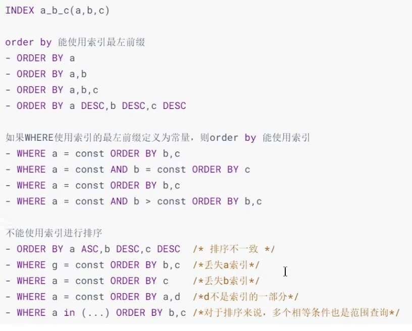

##  数据库调优的维度

- 索引失败、没有充分利用索引——索引建立
- 关联查询太多 `JOIN`（设计缺陷或不得已的需求）——SQL优化
- 服务器调优及各个参数设置（缓冲、线程数等）——调整`my.cnf`
- 数据过多——分库分表

虽然优化的技术很多，但大方向上完全可以分成：

- 物理查询优化：通过**索引** 和**表连接**等技术进行优化，这里重点需要掌握索引的使用。
- 逻辑查询优化：通过SQL**等价变换**提升查询效率，直白地说，换一种查询写法，执行效率可能更高。

## 数据准备

```sql
-- 建库
CREATE DATABASE atguigudb2;
USE atguigudb2;

-- 建表
CREATE TABLE `class` (
 `id` INT(11) NOT NULL AUTO_INCREMENT,
 `className` VARCHAR(30) DEFAULT NULL,
 `address` VARCHAR(40) DEFAULT NULL,
 `monitor` INT NULL ,
 PRIMARY KEY (`id`)
) ENGINE=INNODB AUTO_INCREMENT=1 DEFAULT CHARSET=utf8;

CREATE TABLE `student` (
 `id` INT(11) NOT NULL AUTO_INCREMENT,
 `stuno` INT NOT NULL ,
 `name` VARCHAR(20) DEFAULT NULL,
 `age` INT(3) DEFAULT NULL,
 `classId` INT(11) DEFAULT NULL,
 PRIMARY KEY (`id`)
 -- CONSTRAINT `fk_class_id` FOREIGN KEY (`classId`) REFERENCES `class` (`id`)
) ENGINE=INNODB AUTO_INCREMENT=1 DEFAULT CHARSET=utf8;

-- 函数
set global log_bin_trust_function_creators=1;

-- 随机产生字符串
DELIMITER //
CREATE FUNCTION rand_string(n INT) RETURNS VARCHAR(255)
BEGIN
DECLARE chars_str VARCHAR(100) DEFAULT 'abcdefghijklmnopqrstuvwxyzABCDEFJHIJKLMNOPQRSTUVWXYZ';
DECLARE return_str VARCHAR(255) DEFAULT '';
DECLARE i INT DEFAULT 0;
WHILE i < n DO
SET return_str =CONCAT(return_str,SUBSTRING(chars_str,FLOOR(1+RAND()*52),1)); SET i = i + 1;
END WHILE;
RETURN return_str;
END //
DELIMITER ;

-- 随机产生班级编号
DELIMITER //
CREATE FUNCTION rand_num (from_num INT ,to_num INT) RETURNS INT(11)
BEGIN
DECLARE i INT DEFAULT 0;
SET i = FLOOR(from_num +RAND()*(to_num - from_num+1)) ;
RETURN i;
END //
DELIMITER ;

-- 存储过程
-- 插入学生数据
DELIMITER //
CREATE PROCEDURE insert_stu( START INT , max_num INT ) 
BEGIN
DECLARE i INT DEFAULT 0;
SET autocommit = 0; -- 设置手动提交事务
REPEAT -- 循环
SET i=i+1; -- 赋值
INSERT INTO student (stuno, name ,age ,classId ) VALUES
((START+i),rand_string(6),rand_num(1,50),rand_num(1,1000)); UNTIL i = max_num
END REPEAT;
COMMIT; -- 提交事务
END //
DELIMITER ;

-- 插入班级数据
DELIMITER //
CREATE PROCEDURE `insert_class`( max_num INT ) 
BEGIN
DECLARE i INT DEFAULT 0;
 SET autocommit = 0;
 REPEAT
 SET i = i + 1;
 INSERT INTO class ( classname,address,monitor ) VALUES
(rand_string(8),rand_string(10),rand_num(1,100000));
 UNTIL i = max_num
 END REPEAT;
 COMMIT;
 END //
DELIMITER ;

-- 调用存储过程
CALL insert_class(10000);
CALL insert_stu(100000,500000);

-- 删除某表上的索引
DELIMITER //
CREATE  PROCEDURE `proc_drop_index`(dbname VARCHAR(200),tablename VARCHAR(200))
BEGIN
       DECLARE done INT DEFAULT 0;
       DECLARE ct INT DEFAULT 0;
       DECLARE _index VARCHAR(200) DEFAULT '';
       DECLARE _cur CURSOR FOR  SELECT   index_name   FROM
information_schema.STATISTICS WHERE table_schema=dbname AND table_name=tablename AND seq_in_index=1 AND index_name <>'PRIMARY' ;
 -- 每个游标必须使用不同的declare continue handler for not found set done=1来控制游标的结束
DECLARE CONTINUE HANDLER FOR NOT FOUND set done=2 ; 
-- 若没有数据返回,程序继续,并将变量done设为2
        OPEN _cur;
        FETCH _cur INTO _index;
        WHILE  _index<>'' DO
               SET @str = CONCAT("drop index " , _index , " on " , tablename );
               PREPARE sql_str FROM @str ;
               EXECUTE  sql_str;
               DEALLOCATE PREPARE sql_str;
               SET _index='';
               FETCH _cur INTO _index;
        END WHILE;
   CLOSE _cur;
END //
DELIMITER ;

-- CALL proc_drop_index("dbname","tablename");
```

## 索引失效

用不用索引，最终都是优化器说了算。优化器是基于`cost开销(ContBaseOptimizer)`，它不是基于`规则(Rule-BasedOptimizer)`，也不是基于`语义`，怎么样的开销小就怎么来。另外，**SQL语句是否使用索引，跟数据库版本、数据量、数据选择度都有关系**

### 1. 全值匹配我最爱

```sql
EXPLAIN SELECT * FROM student WHERE age=30;
EXPLAIN SELECT * FROM student WHERE age=30 AND classId=4;
EXPLAIN SELECT * FROM student WHERE age=30 AND classId=4 AND name = 'abcd';

-- 建立索引
CREATE INDEX idx_age ON student(age);
CREATE INDEX idx_age_classid ON student(age,classId);
CREATE INDEX idx_age_classid_name ON student(age,classId,name);
```

### 2. 最佳左前缀法则

```sql
-- CALL proc_drop_index("atguigudb2","student");

EXPLAIN SELECT * FROM student WHERE age=30 AND name = 'abcd';
EXPLAIN SELECT * FROM student WHERE classId=1 AND name = 'abcd';
EXPLAIN SELECT * FROM student WHERE classId=1 AND age=30 AND name = 'abcd';
```

### 3. 主键插入顺序

最好让插入的记录的主键依次递增：让主键具有 `AUTO_INCREMENT`，让存储引擎自己为表生成主键，而不是手动插入。

### 4. 计算、函数导致索引失效

```sql
CALL proc_drop_index("atguigudb2","student");

CREATE INDEX idx_student_name ON student(name);

EXPLAIN SELECT * FROM student WHERE name LIKE 'abc%';
/*
+----+-------------+---------+------------+-------+------------------+------------------+---------+------+------+----------+-----------------------+
| id | select_type | table   | partitions | type  | possible_keys    | key              | key_len | ref  | rows | filtered | Extra                 |
+----+-------------+---------+------------+-------+------------------+------------------+---------+------+------+----------+-----------------------+
|  1 | SIMPLE      | student | NULL       | range | idx_student_name | idx_student_name | 63      | NULL |   28 |   100.00 | Using index condition |
+----+-------------+---------+------------+-------+------------------+------------------+---------+------+------+----------+-----------------------+
*/

EXPLAIN SELECT * FROM student WHERE LEFT(name,3) = 'abc';
/*
+----+-------------+---------+------------+------+---------------+------+---------+------+--------+----------+-------------+
| id | select_type | table   | partitions | type | possible_keys | key  | key_len | ref  | rows   | filtered | Extra       |
+----+-------------+---------+------------+------+---------------+------+---------+------+--------+----------+-------------+
|  1 | SIMPLE      | student | NULL       | ALL  | NULL          | NULL | NULL    | NULL | 451962 |   100.00 | Using where |
+----+-------------+---------+------------+------+---------------+------+---------+------+--------+----------+-------------+
*/

EXPLAIN SELECT * FROM student WHERE name REGEXP '^abc';
/*
+----+-------------+---------+------------+------+---------------+------+---------+------+--------+----------+-------------+
| id | select_type | table   | partitions | type | possible_keys | key  | key_len | ref  | rows   | filtered | Extra       |
+----+-------------+---------+------------+------+---------------+------+---------+------+--------+----------+-------------+
|  1 | SIMPLE      | student | NULL       | ALL  | NULL          | NULL | NULL    | NULL | 451962 |   100.00 | Using where |
+----+-------------+---------+------------+------+---------------+------+---------+------+--------+----------+-------------+
*/

CREATE INDEX idx_student_no ON student(stuno);
EXPLAIN SELECT * FROM student WHERE stuno+1 = 90001;
/*
+----+-------------+---------+------------+------+---------------+------+---------+------+--------+----------+-------------+
| id | select_type | table   | partitions | type | possible_keys | key  | key_len | ref  | rows   | filtered | Extra       |
+----+-------------+---------+------------+------+---------------+------+---------+------+--------+----------+-------------+
|  1 | SIMPLE      | student | NULL       | ALL  | NULL          | NULL | NULL    | NULL | 451962 |   100.00 | Using where |
+----+-------------+---------+------------+------+---------------+------+---------+------+--------+----------+-------------+
*/
```

###  5. 类型转换导致索引失效

```sql
EXPLAIN SELECT * FROM student WHERE name=123;
/*
+----+-------------+---------+------------+------+------------------+------+---------+------+--------+----------+-------------+
| id | select_type | table   | partitions | type | possible_keys    | key  | key_len | ref  | rows   | filtered | Extra       |
+----+-------------+---------+------------+------+------------------+------+---------+------+--------+----------+-------------+
|  1 | SIMPLE      | student | NULL       | ALL  | idx_student_name | NULL | NULL    | NULL | 451962 |    10.00 | Using where |
+----+-------------+---------+------------+------+------------------+------+---------+------+--------+----------+-------------+
*/
```

### 6. 范围条件右边的列索引失效

```sql
CALL proc_drop_index("atguigudb2","student");
CREATE INDEX idx_age_classid_name ON student(age,classId,name);

EXPLAIN SELECT * FROM student WHERE age=30 AND classId>20 AND name = 'abc';

```

创建联合索引中，务必把涉及范围操作的字段放在最右边

### 7. 不等于操作导致索引失效

```sql
CALL proc_drop_index("atguigudb2","student");
CREATE INDEX idx_student_name ON student(name);

EXPLAIN SELECT * FROM student WHERE name<>'abc';
```

### 8. `IS NULL` 可以使用索引，`IS NOT NULL` 无法使用索引

```sql
CALL proc_drop_index("atguigudb2","student");
CREATE INDEX idx_student_age ON student(age);

EXPLAIN SELECT * FROM student WHERE age is null;

EXPLAIN SELECT * FROM student WHERE age is NOT null;
```

`NOT LIKE` 也不能使用索引。

### 9. `LIKE` 以通配符`%`开头导致索引失效

> 页面搜索严禁左模糊或全模糊，如果有需要请走搜索引擎来解决

### 10. `OR` 前后存在非索引的列导致索引失效

### 11. 数据库和表的字符集统一使用 `utf8mb4`

不同的字符集进行比较前需要进行转换，会导致索引失效。

### 一般性建议

- 对于单列索引，尽量选择针对当前query过滤性更好的索引
- 在选择复合索引时，当前query中过滤性最好的字段放在前面
- 在选择复合索引时，尽量选择能够包含当前query中where子中更多字段的索引
- 在选择复合索引时，如果某个字段可能出现范围查询时，尽量把这个字段放在索引次序的最后面

## 关联查询优化数据准备

```sql
CREATE TABLE IF NOT EXISTS type(
	id INT UNSIGNED NOT NULL AUTO_INCREMENT,
  card INT UNSIGNED NOT NULL,
  PRIMARY KEY(id)
);

CREATE TABLE IF NOT EXISTS book(
	bookid INT UNSIGNED NOT NULL AUTO_INCREMENT,
  card INT UNSIGNED NOT NULL,
  PRIMARY KEY(bookid)
);

-- 重复20次
INSERT INTO type(card) VALUES(FLOOR(1+(RAND()*20)));

-- 重复20次
INSERT INTO book(card) VALUES(FLOOR(1+(RAND()*20)));
```

## 关联查询优化-外连接

```sql
EXPLAIN SELECT * FROM type LEFT JOIN book ON type.card=book.card;

CREATE INDEX Y ON book(card);
CREATE INDEX X ON type(card);
```
## 关联查询优化-内连接

```sql
EXPLAIN SELECT * FROM type INNER JOIN book ON type.card=book.card;

CREATE INDEX Y ON book(card);
CREATE INDEX X ON type(card);
```



 ## 分页优化

```sql
SELECT * FROM student LIMIT 2000000,10;

-- 优化1
SELECT * FROM student WHERE id > 2000000 LIMIT  10;
-- 优化2
SELECT s.*
FROM 
	student as s,
	(SELECT id FROM student ORDER BY id LIMIT 2000000,10) AS t
WHERE s.id=t.id
```

## 推荐的主键设计

- 非核心业务：主键自增ID，比如告警、日志、监控等
- 核心业务：主键设计至少应该是全局唯一且是单调递增。

### `uuid`

全局唯一，占用36字节，数据无序，插入性能差

### 改造`uuid`

- Mysql8可以更换时间低位和高位的存储方式，这样UUID就是有序的UUID了
- Mysql8还解决了UUID存在的空间占用问题，除去了无意义的`-`，并且将字符串用二进制类型保存，这样存储空间降低为了16字节
- 可以通过mysql8的`uuid_to_bin`函数实现上述功能，同样的，也提供了`bin_to_uuid`进行转化

```sql
SET @uuid=UUID();
SELECT @uuid, uuid_to_bin(@uuid), uuid_to_bin(@uuid,TRUE);
/*
+--------------------------------------+----------------------------------------+--------------------------------------------------+
| @uuid                                | uuid_to_bin(@uuid)                     | uuid_to_bin(@uuid,TRUE)                          |
+--------------------------------------+----------------------------------------+--------------------------------------------------+
| 83906684-4f58-11ed-a6c8-0242ac110002 | 0x839066844F5811EDA6C80242AC110002     | 0x11ED4F5883906684A6C80242AC110002               |
+--------------------------------------+----------------------------------------+--------------------------------------------------+
*/
```

> `uuid_to_bin()` 第二个参数传 `true`，则进行时间高低位的转换

### 雪花算法
