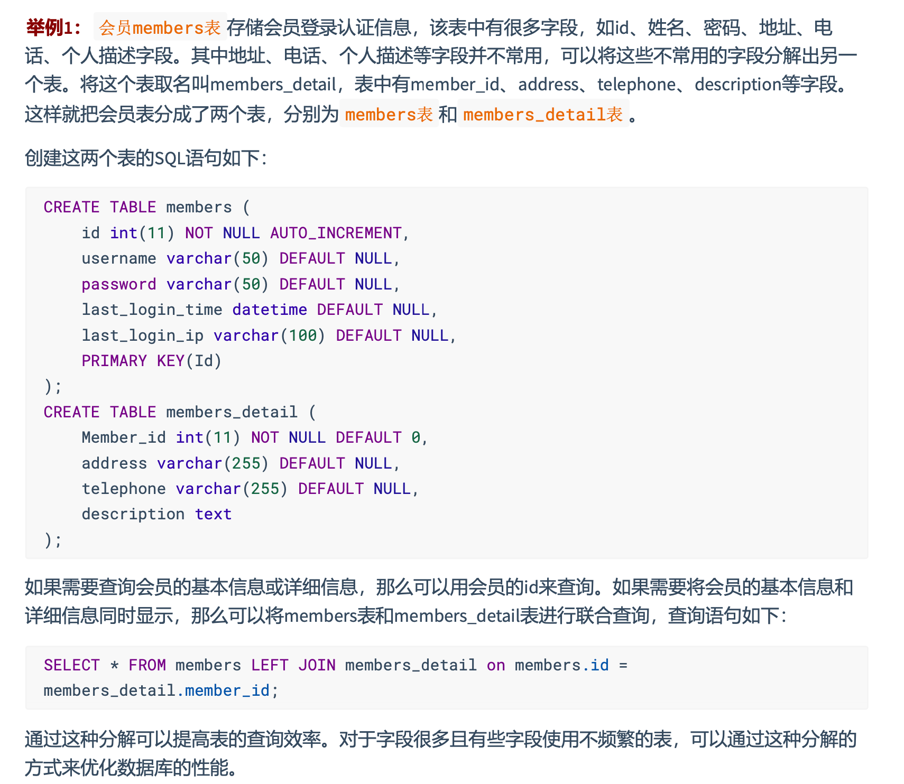
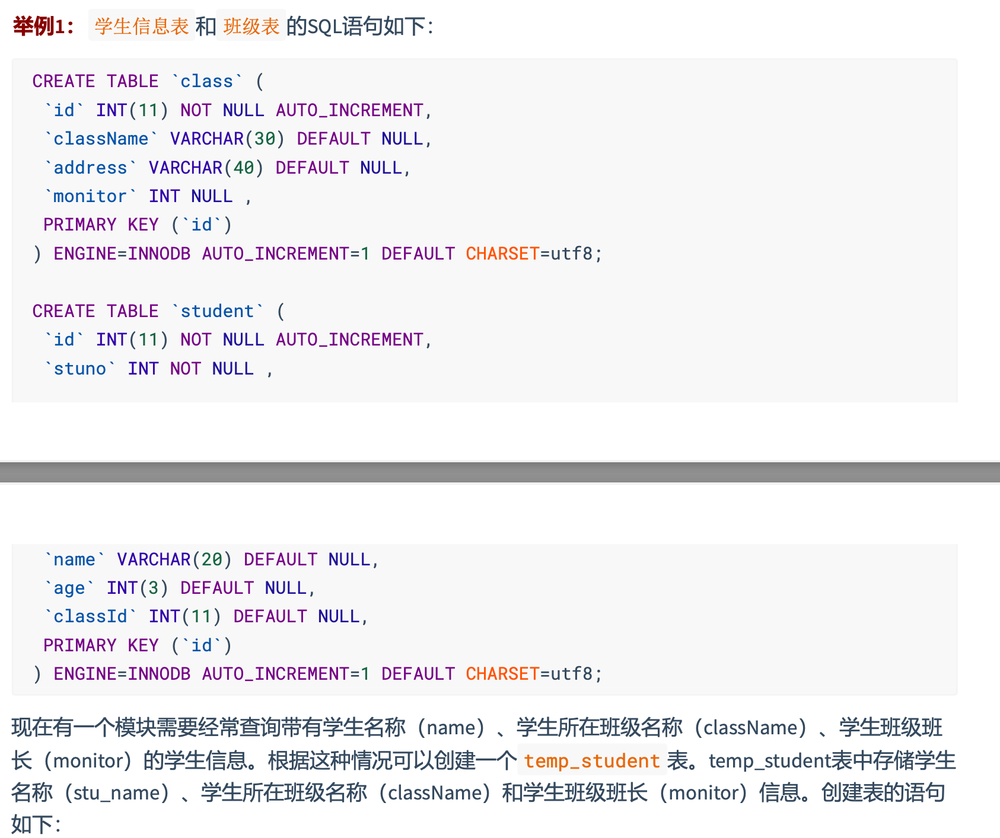
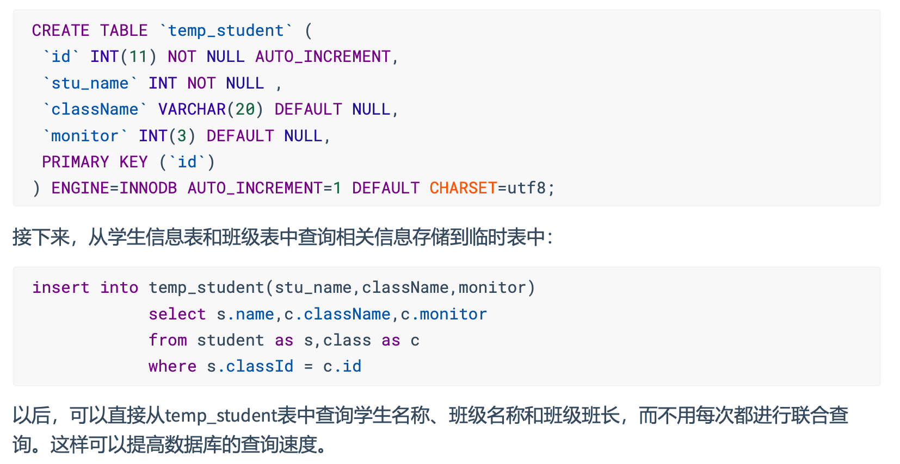
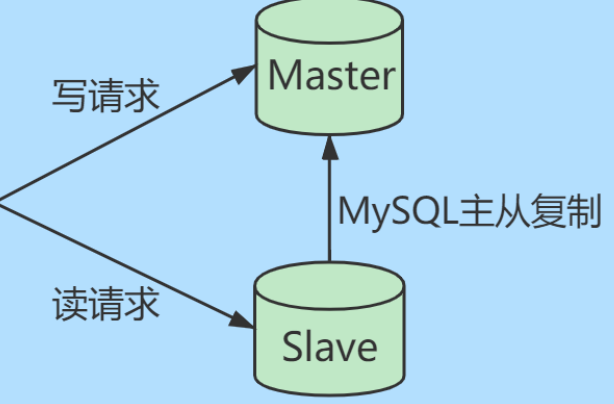
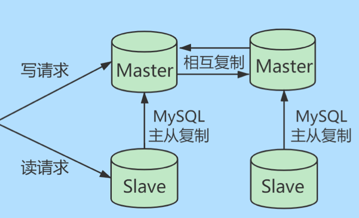
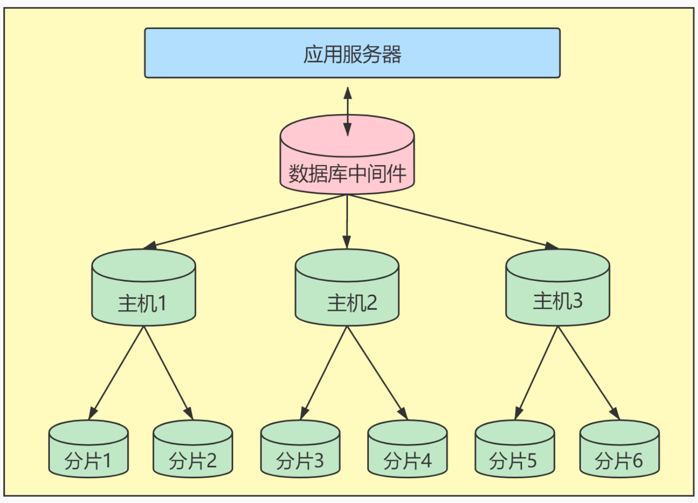
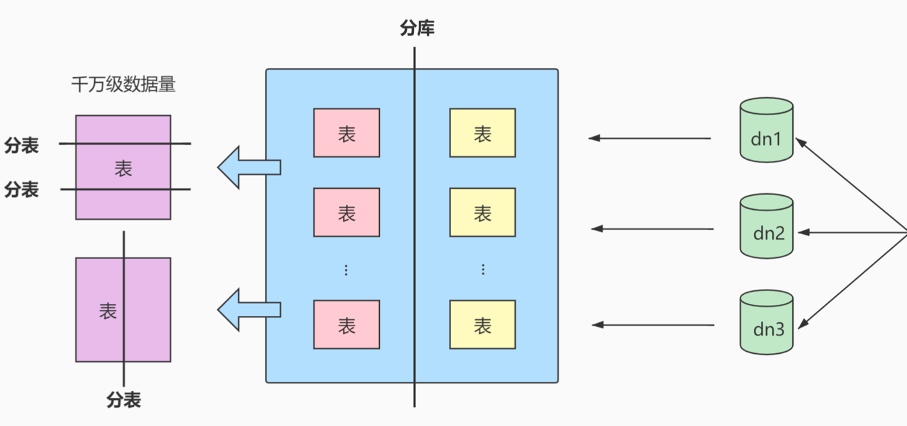
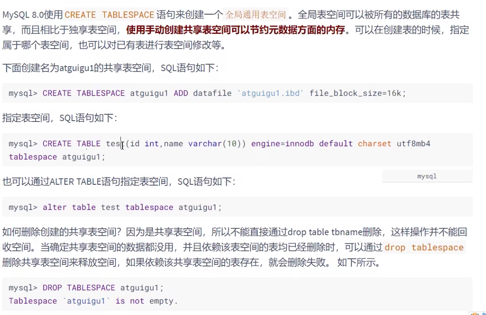

## 优化MySQL参数

- `innodb_buffer_pool_size`：它是MySQL最重要的参数之一，表示 InnoDB类型的**表和索引的最大缓存**。它不仅缓存**索引数据**，还会缓存**表的数据**。这个值越大，查询的速度就会越快。但这个值太大会影响操作系统的性能。

- `key_buffer_size`：表示**索引缓冲区的大小**。索引缓冲区是所有的线程共享。增加索引缓冲区可以得到更好的处理的索引（对所有读和多重写）。当然，这个值不是越大越好，它的大小取决于内存的大小。如果这个值太大就会导致操作系统频繁换页，也会降低系统性能。对于内存4G左右的服务器，该参数可设置256M或384M。

- `table_cache`：表示**同时打开表的个数**。这个值越大，能够同时打开的表个数越多。物理内存越大，设置就越多。黑夜为2402，调整到512～1024最佳。这个值不是越大越好，因为同时打开的表太多会影响操作系统的性能。

- `query_cache_size`：表示**查询缓冲区的大小**。可以通过MySQL控制台观察，如果 `Qcache_lowmem_prunes` 的值非常大，则表明经常出现缓冲不够的情况，就要增加这个参数的值；如果`Qcache_hits`的值非常大，则表明查询缓冲使用非常频繁，如果该值较小反而会影响效 率，那么可以考虑不用查询缓存`;Qcache_free_blocks`，如果该值非常大，则表明缓冲区中碎片很 多。MySQL8.0之后失效。该参数需要和`query_cache_type`配合使用。

- `query_cache_type` 的值是0时，所有的查询都不使用查询缓存区。但是`query_cache_type=0`并不 会导致MySQL释放`query_cache_size`所配置的缓存区内存。

  - 当`query_cache_type=1`时，所有的查询都将使用查询缓存区，除非在查询语句中指定 `SQL_NO_CACHE` ，如`SELECT SQL_NO_CACHE * FROM tbl_name`。
  - 当`query_cache_type=2`时，只有在查询语句中使用 `SQL_CACHE` 关键字，查询才会使用查询缓 存区。使用查询缓存区可以提高查询的速度，这种方式只适用于修改操作少且经常执行相同的 查询操作的情况。

- `sort_buffer_size`：表示每个**需要进行排序的线程分配的缓冲区的大小** 。增加这个参数的值可以 提高 `ORDER BY` 或 `GROUP BY` 操作的速度。默认数值是2097144字节(约2MB)。对于内存在4GB 左右的服务器推荐设置为6～8M，如果有100个连接，那么实际分配的总共排序缓冲区大小为`100 × 6 = 600MB`。

- `join_buffer_size = 8M` :表示**联合查询操作所能使用的缓冲区大小** ，和`sort_buffer_size`一样， 该参数对应的分配内存也是每个连接独享。

- `read_buffer_size `:表示**每个线程连续扫描时为扫描的每个表分配的缓冲区的大小(字节)** 。当线程从表中连续读取记录时需要用到这个缓冲区。`SET SESSION read_buffer_size=n`可以临时设置该参 数的值。默认为64K，可以设置为4M。

- `innodb_flush_log_at_trx_commit` :表示**何时将缓冲区的数据写入日志文件** ，并且将日志文件 写入磁盘中。该参数对于innoDB引擎非常重要。该参数有3个值，分别为0、1和2。该参数的默认值 为1。

  - 值为 `0 `时，表示**每秒1次**的频率将数据写入日志文件并将日志文件写入磁盘。每个事务的 commit并不会触发前面的任何操作。该模式速度最快，但不太安全，mysqld进程的崩溃会导 致上一秒钟所有事务数据的丢失。
  - 值为 `1`时，表示**每次提交事务时**将数据写入日志文件并将日志文件写入磁盘进行同步。该模式是最安全的，但也是最慢的一种方式。因为每次事务提交或事务外的指令都需要把日志写入 (`flush`)硬盘。
  - 值为 `2` 时，表示**每次提交事务时**将数据写入日志文件， **每隔1秒**将日志文件写入磁盘。该模式速度较快，也比0安全，只有在操作系统崩溃或者系统断电的情况下，上一秒钟所有事务数 据才可能丢失。

- `innodb_log_buffer_size`:这是 InnoDB 存储引擎的**事务日志所使用的缓冲区 **。为了提高性能， 也是先将信息写入 Innodb Log Buffer 中，当满足` innodb_flush_log_trx_commit` 参数所设置的相应条 件(或者日志缓冲区写满)之后，才会将日志写到文件(或者同步到磁盘)中。

- `max_connections`:表示**允许连接到MySQL数据库的最大数量** ，默认值是 `151` 。如果状态变量 `connection_errors_max_connections` 不为零，并且一直增长，则说明不断有连接请求因数据库连接 数已达到允许最大值而失败，这是可以考虑增大`max_connection`s 的值。在Linux 平台下，性能好的 服务器，支持 500～1000 个连接不是难事，需要根据服务器性能进行评估设定。这个连接数**不是越大越好** ，因为这些连接会浪费内存的资源。过多的连接可能会导致MySQL服务器僵死。

- `back_log`：用于**控制MYSQL监听TCP端口时设置的积压请求栈大小**。如果MySql的连接数达到` max_connections`时，新来的请求将会被存在堆栈中，以等待某一连接释放资源，该堆栈的数量即 `back_log`，如果等待连接的数量超过`back_log`，将不被授予连接资源，将会报错。5.6.6 版本之前默 认值为 50 ， 之后的版本默认为 `50 + (max_connections / 5)`， 对于Linux系统推荐设置为小于512 的整数，但最大不超过900。如果需要数据库在较短的时间内处理大量连接请求， 可以考虑适当增大`back_log` 的值。

- `thread_cache_size`：**线程池缓存线程数量的大小** ，当客户端断开连接后将当前线程缓存起来， 当在接到新的连接请求时快速响应无需创建新的线程 。这尤其对那些使用短连接的应用程序来说可 以极大的提高创建连接的效率。那么为了提高性能可以增大该参数的值。默认为60，可以设置为 120。

  可以通过如下几个 MySQL 状态值来适当调整线程池大小：

  ```sql
  SHOW GLOBAL STATUS LIKE 'Thread%';
  /*
  +-------------------+-------+
  | Variable_name     | Value |
  +-------------------+-------+
  | Threads_cached    | 0     |
  | Threads_connected | 1     |
  | Threads_created   | 1     |
  | Threads_running   | 2     |
  +-------------------+-------+
  */
  ```

  当 `Threads_cached` 越来越少，但 `Threads_connected` 始终不降，且 `Threads_created` 持续升高，可以适当增加 `thread_cache_size` 的大小。

- `wait_timeout`:指定**一个请求的最大连接时间**，对于4G左右内存的服务器，可以设置为5～10

- `interactive_timeout`：表示服务器在关闭连接前等待行动的秒数

## 优化数据库结构

### 拆分表：冷热数据分离



### 增加中间表





### 增加冗余字段

表的规范化程度越高，表与表之间的关系就越多，需要连接查询的情况也就越多。尤其在数据量大，而
且需要频繁进行连接的时候，为了提升效率，我们也可以考虑增加冗余字段来减少连接。

### 优化数据类型

- 对整数类型进行优化

- 既可使用文本也可使用整数的字段，要选择使用整数类型

- 避免使用 TEXT/ BLOB 数据类型

  分离到单独的扩展表中，查询时不要 `SELECT  *`

- 避免使用 ENUM 类型

  修改ENUM值需要使用ALTER语句。它的 ORDER BY 操作效率低，需要额外操作。使用TINYINT来代替。

- 使用 TIMESTAMP 存储时间

- 使用 DECIMAL 代替 FLOAT 和 DOUBLE 存储精确浮点数

### 优化插入记录的速度

MyISAM：

- 禁用索引
- 禁用唯一性检查
- 使用批量插入
- 使用 LOAD DATA INFILE 批量导入

InnoDB:

- 禁用唯一性检查

  导入数据前禁用唯一性检查，导入完成后开启：

  ```sql
  SET unique_checks = <0|1>;
  ```

- 禁用外键检查

  ```sql
  SET foreign_key_checks = <0|1>;
  ```

- 禁止自动提交

  ```sql
  SET autocommit = <0|1>;
  ```

### 使用非空约束

- 进行比较和计算时，省去判断`NULL`的开销，提高存储效率
- 更容易创建索引

### 分析表、检查表与优化表

#### 分析表

```sql
ANALYZE [LOCAL | NO_WRITE_TO_BINLOG] TABLE 表1,表2...
```

`ANALYZE TABLE`分析后的统计结果会反应到 `cardinality`的值，该值统计了表中某一键所在的列不重复 的值的个数。 **该值越接近表中的总行数，则在表连接查询或者索引查询时，就越优先被优化器选择使 用。** 也就是索引列的`cardinality`的值与表中数据的总条数差距越大，即使查询的时候使用了该索引作为查 询条件，存储引擎实际查询的时候使用的概率就越小。

#### 检查表

```sql
CHECK TABLE 表1[,表2...] [OPTION] ...
OPTION = { QUICK | FAST | MEDIUM | EXTENDED | CHANGED}
```

- `QUICK`：不扫描行，不检查错误的连接
- `FAST`：只检查没有被正确关闭的表
- `CHANGED`：只检查上次检查后被理性的表和没有被正常关闭的表
- `MIDIUM`：扫描行，以验证被删除的连接是有效的。也可以计算各行的关键字校验和，并使用计算出的校验和验证这一点
- `EXTENDED`：对每行的所有关键字进行一个全面的关键字查找。可以确保表是`100%`一致的。

`OPTION` 只对 MyISAM 类型的表有效。

#### 优化表

##### `OPTIMIZE`

```sql
OPTIMIZE [LOCAL | NO_WRITE_TO_BINLOG] TABLE 表1,表2...
```

##### `mysqlcheck`

```bash
mysqlcheck -o 数据库名 表名 -u root -p
```

## 大表优化

### 限定查询范围

禁止不带任何限制数据范围条件的查询语句。

### 读写分离

一主一从模式



双主双从模式



### 垂直拆分

当数据量达到千万级以上时，需要把一个数据库切成多份，放在不同的数据库服务器上，减少对单一数据库服务器的访问压力

- 如果数据库中的表过多，可以采用**垂直分库**的方法，将关联的数据表部署在同一个数据库上
- 如果数据表中的字段过多，可以采用**垂直分表**的方式，将一张数据表拆分成多张数据表，把经常一起使用的字段放在同一张表里。



- 优点：可以使得列数据变小，在查询时减少读取的Block数，减少I/O次数。此外，垂直分区 可以简化表的结构，易于维护。
- 缺点：主键会出现冗余，需要管理冗余列，并会引起 JOIN 操作。此外，垂直拆分会让事务 变得更加复杂。

### 水平拆分

- 尽量控制单表数据量，建议控制在1000W以内（这个数值并不是MYSQL的限制）。过大会千万修改表结构、备份、恢复都会有很大的问题。此时可以用**历史数据归档**（应用于日志数据）、水平分表（应用于业务数据）等手段来控制数据量大小。
- 将大的数据表按照**某个属性维度**分拆成不同的小表，每张小表能保持相同的表结构。比如按年份拆分等。
- 水平分表仅是解决了单一表数据过大的问题，但由于表的数据还是在同一台机器上，其实对于提升Mysql并发能力并没什么什么意义，所以**水平拆分最好分库**，从而达到分布式的目的。



水平拆分能够支持非常大的数据量存储，应用端改造也少，但分片事务难以解决，跨节点`JOIN`性能较差，逻辑复杂。**尽量不要对数据进行分片，因为拆分会带来逻辑、部署、运维的各种复杂度**。

## 其它调优策略

### 服务器语句超时处理

在MySQL 8.0中可以设置 服务器语句超时的限制 ，单位可以达到 毫秒级别 。当中断的执行语句超过设置的 毫秒数后，服务器将终止查询影响不大的事务或连接，然后将错误报给客户端。

设置服务器语句超时的限制，可以通过设置系统变量 `MAX_EXECUTION_TIME` 来实现。默认情况下， `MAX_EXECUTION_TIME的`值为`0`，代表没有时间限制。 例如:

`SET GLOBAL MAX_EXECUTION_TIME=2000;`
` SET SESSION MAX_EXECUTION_TIME=2000; #指定该会话中SELECT语句的超时时间`

### 创建全局通用表空间




### MYSQL8 隐藏索引对调优的帮助


