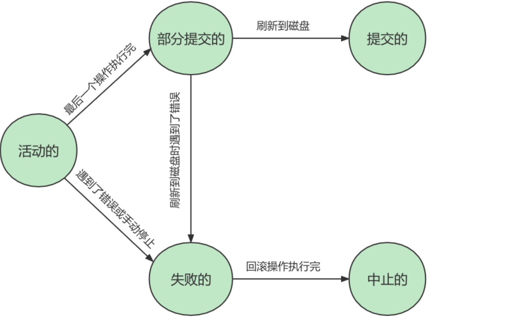

## 事务

一组逻辑操作单元，使数据从一种状态变换到另一种状态。

**事务处理原则：**保证所有事务都作为**一个工作单元**来执行，即使出现了故障，都不能改变这种执行方式。当在一个事务中执行多个操作时，要么所有事务都被提交`commit`，那么这些修改就**永久**地保存下来；要么数据库管理系统将**放弃**所作的所有修改，整个事务回滚`rollback`到最初状态。

## 事务的ACID特性

- 原子性(automicity)

  事务是一个不可分割的工作单位，要么全部提交，要么全部失败回滚，不存在中间状态。

- 一致性(consistency)

  事务执行前台，数据从一个**合法性状态**变换到另一个**合法性状态**，这种状态是**语义上**的，而不是语法上的，跟具体业务有关。

  合法的数据状态：满足**预定的约束**的状态。满足这个状态，数据就是一致的，不满足就不一致。如果事务中某个操作失败了，系统就会自动撤销当前正在执行的事务，返回到事务操作之前的状态。

- 隔离性(isolation)

  是指一个事务的执行**不能被其它事务干扰**，即一个事务内部的操作及使用的数据对**并发**的其它事务是隔离的，并发执行的各个事务之间互不干扰。

- 持久性(durability)

  事务一旦提交，它对数据库中数据的改变是**永久性**的，接下来的其它操作和数据库故障不应该对其有任何影响。

  持久性是通过**事务日志**来保证的。日志包括了**重做日志**和**回滚日志**。通过事务对数据进行修改的时候，首先会将数据库的变化信息记录到重做日志中，然后再对数据库中对应的行进行修改。这样做的好处是，即使数据库系统崩溃，数据库重启后也能找到没有更新到数据库系统中的重做日志，重新执行，从而使用事务具有持久性。

**小结**：

ACID 是事务的四大特性，在这四个特性中，原子性是基础，隔离性是手段，一致性是约束条件，持久性是我们的目的。

## 事务的状态

- 活动(`active`)：事务对应的数据库操作正在执行过程中
- 部分提交(`partially committed`)：事务中最后一个操作执行完成，但由于操作都在内存中执行，所千万的影响并没有刷新到磁盘时，该事务处于部分提交状态
- 失败(`failed`)：当事务处在**活动**或**部分提交**状态时，可能遇到了某些错误（数据库自身的错误、操作系统错误或者直接断电等）而无法继续执行，或者人为的停止当前事务的执行，该事务就处于**失败**状态。
- 中止(`aborted`)：如果事务执行了一部分而变成**失败**状态，就需要把已修改的事务中的操作还原到事务执行前的状态，这个过程为**回滚**。当回滚操作执行完毕时，也就是数据库恢复到了事务执行前的状态，那么该事务就是中止状态。
- 提交(`committed`)：当一个处在**部分提交**状态的事务将修改过的数据都同步到磁盘之后，该事物就是提交状态。



## 显式事务

```sql
-- 开启事务
-- 方式1
START TRANSACTION [READ ONLY | READ WRITE(默认) | WITH CONSISTENT SNAPSHOT];
-- 方式2
BEGIN;

-- 回滚事务
ROLLBACK [TO SAVEPOINT];

-- 提交事务
COMMIT;
```

- `READ ONLY`：只读事务
- `READ WRITE`：读写事务
- `WITH CONSISTENT SNAPSHOT`：启动一致性读

`SAVEPOINT`的相关操作：

```sql
-- 创建保存点，方便后续对保存点进行回滚，一个事务中可以存在多个保存点
SAVEPOINT 保存点名称;

-- 删除保存点
RELEASE SAVEPOINT 保存点名称
```

## 隐式事务

```sql
SET AUTOCOMMIT = FALSE;
```

> 当我们设置 `autocommit=0` 时，不论是否采用 `START TRANSACTION` 或者 `BEGIN` 的方式来开启事 务，都需要用 `COMMIT` 进行提交，让事务生效，使用 `ROLLBACK` 对事务进行回滚。
>
> 当我们设置 `autocommit=1` 时，每条 SQL 语句都会自动进行提交。 不过这时，如果你采用 `START TRANSACTION` 或者 `BEGIN` 的方式来显式地开启事务，那么这个事务只有在 `COMMIT` 时才会生效， 在` ROLLBACK` 时才会回滚。

## `completion_type`参数

- `0`：默认值。执行 `COMMIT` 的时候会提交事务，在执行下一个事务时，还需要使用 `START TRANSACTION / BEGIN` 开启
- `1`：提交事务后，相当于执行了 `COMMIT AND CHAIN`，也就是开启一个链式事务，即提交事务之后会开启一个相同隔离级别的事务
- `2`：这种情况下，`COMMIT = COMMIT AND RELEASE`，就是提交事务后，会自动与服务器断开连接

## 数据的并发问题

```sql
-- 数据准备
CREATE TABLE student(
	studentno INT,
  name VARCHAR(20),
  class VARCHAR(20),
  PRIMARY KEY(studentno)
);

INSERT INTO student VALUES (1, 'foo', '1班');
```

### 脏写 `Dirty Write`

对于两个事务，如果B修改了数据但未提交数据，而A修改了这个数据，那就意味着发了脏写：


### 脏读 `Dirty Read`

B更新但还没提交的数据，被A读取了。若B回滚事务，A读取的数据就是临时且无效的。


### 不可重复读 `Non-Repeatable Read`

A读取了一个字段值，B更新了这个字段，之后A再次读取同一字段，值就不同了。


### 幻读 `Phantom`

A从表中读取了一个字段，然后B在该表中插入一些新的行，之后如果A再次读取同一个表，就会多出几行。


### 严重性

```
脏写 > 脏读 > 不可重复读 > 幻读
```

## SQL标准中的四种隔离级别

- `READ UNCOMMITTED`：读未提交，在该隔离级别，所有事务都可以看到其它未提交事务的执行结果，不能避免脏读、不可重复读、幻读
- `READ COMMITED`：读已提交，它满足了隔离的简单定义：一个事务只能看到已提交事务所做的改变。这是大多数数据库系统的默认隔离级别（但不是MYSQL默认的）。可以避免脏读，但不可重复读、幻读依然存在
- `REPEATABLE READ`：可重复读。事务A读到一条数据之后，此时事务B对该数据进行修改并提交，那么事务A读到的还是原来的内容。可以避免脏读、不可重复读，但幻读依然存在。这是MYSQL的默认隔离级别。
- `SERIALIZABLE`：可串行化。确保事务可以从一个表中读取相同的行。在这个事务持续期间，禁止其它事务对该表执行插入、更新和删除操作。所有的并发问题都可以避免，但性能十分低下。能避免脏读、不可重复读和幻读。


> `脏写` 太严重了，无论哪种隔离级别都不允许该情况的发生。

不同隔离级别有不同的现象，并有不同的锁和并发机制。隔离级别越高，数据库的并发性能就越差：


## MYSQL中的四种隔离级别

```sql
-- 查看事务隔离级别
SELECT @@transaction_isolation;

-- 设置事务隔离级别
SET [GLOBAL|SESSION] TRANSACTION ISOLATION LEVEL <READ UNCOMMITTED|READ COMMITTED|REPEATABLE READ|SERIALIZABLE>;
-- 或
SET [GLOBAL|SESSION] TRANSACTION_ISOLATION = "<READ-UNCOMMITTED|READ-COMMITTED|REPEATABLE-READ|SERIALIZABLE>"
```

设置时使用`GLOBAL`或`SESSION`的影响：

- `GLOBAL`
  - 当前已存在的会话无效
  - 只对执行完该语句后产生的会话起作用
- `SESSION`
  - 当前会话所有后续事务有效
  - 如果在事务之间执行，则对后续事务有效
  - 该语句可以在已开启的事务中间执行，但不影响当前正在执行的事务
