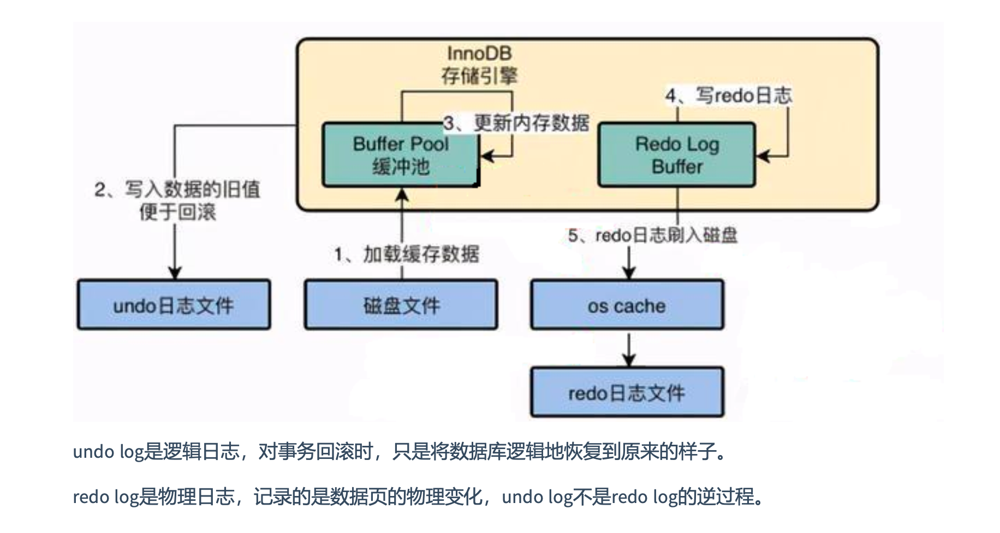

- 事务的隔离性由**锁机制**实现。
- 事务的原子性、一致性和持久性由事务的 `redo` 日志和 `undo` 日志来保证
  - `REDO LOG`：重做日志，提供再写入操作，恢复提交事务修改的页操作，用来保证事务的持久性
  - `UNDO LOG`：回滚日志，回滚行记录到某个特定版本，用来保证事务的原子性、一致性。

`UNDO`和`REDO`不是逆过程，都可以视为一种**恢复操作**，但是：

- `REDO LOG`：是存储引擎层INNODB生成的日志，记录的是**物理级别**上的页修改操作，比如页号XXX、偏移量YYY写入了ZZZ数据。主要为了保证数据的可靠性
- `UNDO LOG`：是存储引擎层INNODB生成的日志，记录的是**逻辑操作**日志。比如对某一行数据进行了 INSERT 操作，那么 UNDO LOG 就记录一条与之相反的 DELETE 操作。主要用于**事务的回滚**（UNDO LOG 记录的是每个修改操作的逆操作）和**一致性非锁定读**（UNDO LOG 回滚行记录到某种特定的版本——MVCC,即多版本并发控制）

 ## `REDO LOG` 重做日志

**好处**：

- 降低了刷盘频率
- 占用的空间非常小

**特点**：

- 顺序写入磁盘
- 事务执行过程中，REDO LOG 不断记录

**组成**

- 重做日志的缓存(redo log buffer)

  ```sql
  show variables like '%innodb_log_buffer_size%'
  -- 默认16M，最大值4096M，最小值1M
  ```

- 重做日志文件(redo log file)

  ```
  /var/lib/mysql
  	ib_logfile0
  	ib_logfile1
  ```

**整体流程**

- 先将原始数据从磁盘读入内存中，修改数据的内存拷贝
- 生成一条重做日志并写入 redo log buffer，记录的是数据被修改后的值
- 当事务COMMIT时，将 redo log buffer 中的内容刷新到 redo log file，对 redo log file 采用追加写的方式
- 定期将内存中修改的数据刷新到硬盘中

**REDO LOG的刷盘策略**

`innodb_flush_log_at_trx_commit` 参数控制COMMIT提交事务时，如何将 REDO LOG BUFFER 中的日志刷新到 REDO LOG FILE中。

- 设置为`0`：表示每次事务提交时不进行刷盘操作。（系统默认master thread 每隔1秒进行一次重做日志的同步）
- 设置为`1`：表示每次事务提交时都将进行同步，刷盘工作（默认值）
- 设置为`2`：表示每次事务提交时都只把 REDO LOG BUFFER 内容写入 page cache，不进行同步，由操作系统自己决定什么时候同步到磁盘文件。

## `UNDO LOG` 回滚日志

在事务中更新数据（INSERT / UPDATE/ DELETE 等）的前置操作其实是要先写入一个 UNDO LOG。

UNDO LOG 会产生 REDO LOG，这是因为 UNDO LOG 也需要持久性的保护。

**作用**

- 回滚数据
- MVCC

## 小结

