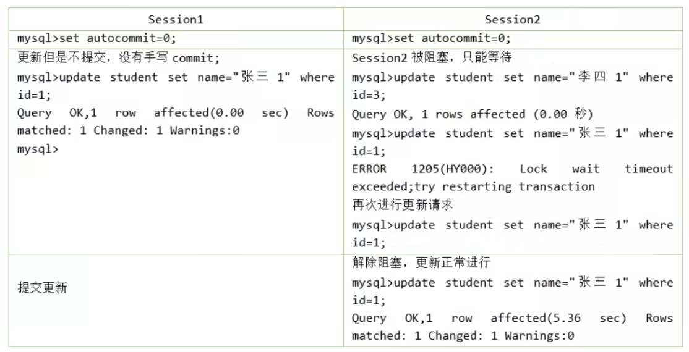
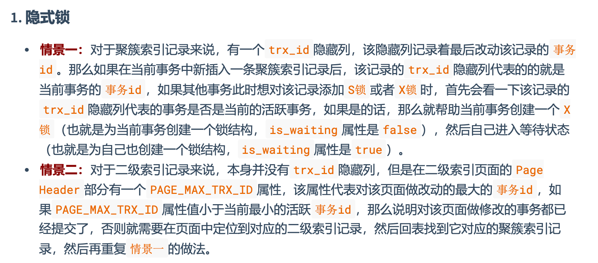
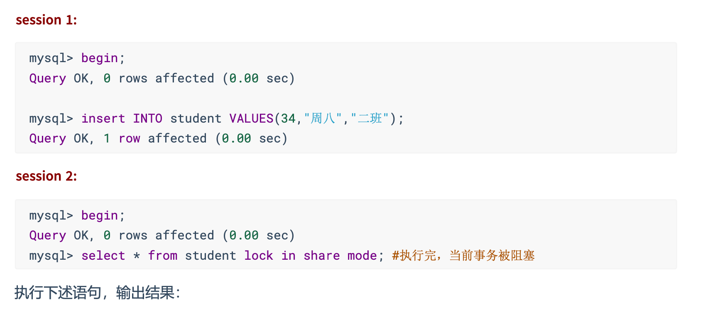
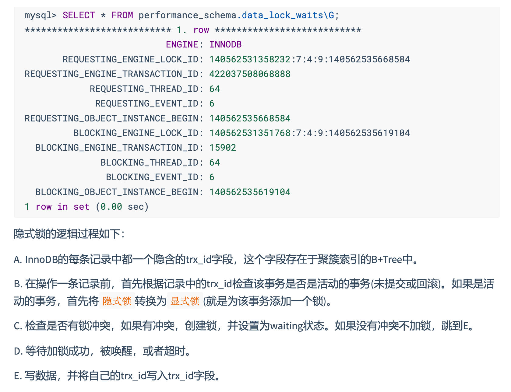
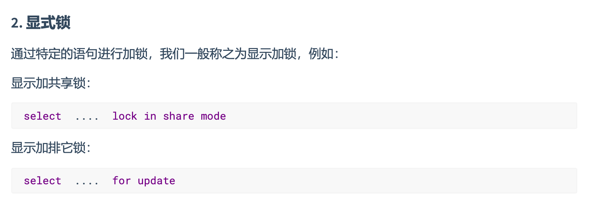

## 并发问题的解决方案

- 方案一：读操作利用多版本并发控制MVCC，写操作进行加锁
- 方案二：读、写操作都采用加锁的方式

## 数据操作类型划分：读(S)锁、写(X)锁

- 读锁：也称共享锁(Shared Lock)，英文用`S`表示。针对同一份数据，多个事务的读操作可以同时进行而不会互相影响
- 写锁：也称排他锁（Exclusive Lock），英文用`X`表示。当前写操作没有完成前，它会阻断其它写锁和读锁。这样就能确保在给定的时间里，只有一个事务能执行写入，并防止其它用户读取正在写入的同一资源

对于 INNODB 来说，读锁和写锁可以加在表上，也可以加在行上。

### 锁定读

- 对读取的记录加`S`锁

  ```sql
  SELECT ... LOCK IN SHARE MODE;
  -- 或 
  SELECT ... FOR SHARE; -- 8.0新增语法
  ```

- 对读取的记录加`X`锁

  ```sql
  SELECT ... FOR UPDATE;
  ```

## 数据操作粒度划分：表锁、行锁、页锁

### 表锁(Table Lock)

会锁定整张表，这是 MySQL 中最基本的锁策略，并不依赖于存储引擎。可以很好的避免死锁，但会导致并发率大打折扣。

#### 表级别的`S`锁、`X`锁

一般情况下，不会使用InnoDB的表级锁。只是会在诸如崩溃恢复等特殊情况下用到。比如，在系统变量 `autocommit=0, innodb_table_locks=1`时，手动获取 INNODB 的表级锁：

```sql
LOCK TABLES 表名 READ; -- 表级S锁
LOCK TABLES 表名 WRITE; -- 表级X锁
```

尽量避免使用INNODB的表级锁，它们并不会提供什么额外的保护，只是会降低并发能力而已。 

**MYISAM**的表锁：

```sql
CREATE TABLE mylock(
	id INT PRIMARY KEY AUTO_INCREMENT,
  name VARCHAR(20)
) ENGINE=MYISAM;

INSERT INTO mylock(name) VALUES('a');

-- 查看加锁情况
SHOW OPEN TABLES WHERE  table = 'mylock' AND in_use > 0;

-- 表级S锁
LOCK TABLES mylock READ;
-- 表级X锁
LOCK TABLES mylock WRITE;

-- 释放锁
UNLOCK TABLES;
```

| 锁类型 | 自己可读 | 自己可写 | 自己可操作其它表 | 他人可读 | 他人可写 |
| ------ | -------- | -------- | ---------------- | -------- | -------- |
| 读锁   | 是       | 否       | 否               | 是       | 否，等   |
| 写锁   | 是       | 是       | 否               | 否，等   | 否，等   |

#### 意向锁(intention lock)

InnoDB支持多粒度锁，它允许行级锁和表级锁共存，而意向锁就是其中的一种表锁。

- 意向锁的存在是为了协调行锁和表锁的关系，支持多粒度的锁并存
- 意向锁是一种**不与行锁冲突的表锁**
- 表明*某个事务正在某些行持有了锁，或该事务准备去持有锁*

```sql
-- 意向S锁(Intention Share lock, IS 锁)
-- 事务要获取某些行的 S 锁，必须先获得表的 IS 锁
SELECT 字段 FROM 表名 ... LOCK IN SHARE MODE;

-- 意向X锁(Intention Exclusive lock, IX 锁)
-- 事务要获取某些行的 X 锁，必须先获取表的 IX 锁
SELECT 字段 FROM 表名 ... FOR UPDATE;
```

意向锁是存储引擎自己维护的，用户无法手动操作。在为数据行加S/X锁之前，InnoDB会先获取该数据行所在表的对应意向锁。


#### 自增锁(auto-inc)

AUTO-INC锁是当向使用含有`AUTO_INCREMENT`的表中插入数据时，需要获取的一种特殊的表级锁。在执行插入语句时，就在表级别加一个 auto-inc锁，然后为每条待插入记录的`AUTO_INCRMENT`分配递增的值，语句执行结束后，再把AUTO-INC锁释放掉。一个事务中持有AUTO-INC锁的过程中，其它事务的插入语句都要被阻塞。正因如此，并发潜力很低下。

INNODB通过 `innodb_autoinc_lock_mode`来提供不同的锁定机制，从而显著提高SQL语句的可伸缩性和性能。

- `0`：传统锁定模式。所有INSERT语句都会获得表级AUTO-INC锁
- `1`：连续锁定模式。MYSQL 8之前的默认模式。批量插入仍然使用AUTO-INC表级锁。简单插入则通过`mutex(轻量锁)`的控制下获得所需数量的自动递增值来避免表级AUTO-INC锁。
- `2`：交错锁定模式。MYSQL 8的默认模式。自动递增值**保证**在所有并发执行的所有类型的INSERT语句中是**唯一**且**单调递增**的。但是由于多个语句可以同时生成数字（即跨语句交叉编号），**为任何给定语句插入的行生成的值不是连续的**。

#### 元数据锁(MDL)

MDL （Meta Data Lock）的作用是保证读写的正确性。当对一个表做增删改查操作时，加 MDL 读锁；当要对表做结构变更时，加 MDL 写锁。该锁不需要显式使用。

### INNODB中的行锁

- 优点：锁定力度小，发生锁冲突概率低，可以实现的并发度高
- 缺点：对于锁的开销比较大，加锁会比较慢，容易出现死锁

#### 记录锁(Record Locks)

仅仅把一条记录锁上，官方名称为 `LOCK_REC_NOT_GAP`，有`S`锁和`X`锁之分。



#### 间隙锁(Gap Locks)

MySQL 在 `REPEATABLE READ` 隔离级别下是可以解决幻读问题的，方案有两种：`MVCC`方案和`加锁`方案。

使用加锁方案时有个问题，那就是事务在第一次执行读取操作时，那些幻影记录尚不存在，无法加上**记录锁**。InnoDB 提出一种间隙锁，官方类型名称为：`LOCK_GAP`。

间隙锁的提出仅仅是为了防止插入幻影记录。无论是`S`还是`X`，它们起的作用是相同的。而且如果对一条记录加了间隙锁，并不会限制其它事务对其加记录锁或继续加间隙锁。

#### 临键锁(Next-Key Locks)

有时候既想锁住某条记录，又想阻止其它事务在该记录前边的间隙插入新记录，就可以使用临键锁，官方名称为 `LOCK_ORDINARY`。它是事务级别在**可重复读**的情况下使用的锁，InnoDB默认的锁就是临键锁。它的本质就是**记录锁**和**间隙锁**的合体。

```sql
BEGIN;
SELECT * FROM student WHERE id >3 AND id<=8 FOR UPDATE;
```


#### 插入意向锁(Insert Intention Locks)

我们说一个事务在 插入 一条记录时需要判断一下插入位置是不是被别的事务加了 gap锁 ( next-key锁 也包含 gap锁 )，如果有的话，插入操作需要等待，直到拥有 gap锁 的那个事务提交。但是InnoDB**规 定事务在等待的时候也需要在内存中生成一个锁结构**，表明有事务想在某个 间隙 中 插入 新记录，但是现在在等待。InnoDB就把这种类型的锁命名为插入意向锁，官方的类型名为 `LOCK_INSERT_INTENTION` 。插入意向锁是一种在插入一条记录前，由 `INSERT` 操作时产生的一种间隙锁。

事实上 **插入意向锁并不会阻止别的事务继续获取该记录上任何类型的锁。**

### 页锁

页锁就是在 页的粒度 上进行锁定，锁定的数据资源比行锁要多，因为一个页中可以有多个行记录。当我 们使用页锁的时候，会出现数据浪费的现象，但这样的浪费最多也就是一个页上的数据行。 **页锁的开销 介于表锁和行锁之间，会出现死锁。锁定粒度介于表锁和行锁之间，并发度一般。**

每个层级的锁数量是有限制的，因为锁会占用内存空间， 锁空间的大小是有限的 。当某个层级的锁数量 超过了这个层级的阈值时，就会进行 锁升级 。锁升级就是用更大粒度的锁替代多个更小粒度的锁，比如 InnoDB 中行锁升级为表锁，这样做的好处是占用的锁空间降低了，但同时数据的并发度也下降了。

## 对待锁的态度划分：乐观锁、悲观锁

乐观锁和悲观锁并不是锁，而是锁的 设计思想 。

### 悲观锁(Pessimistic Locking)

对数据被其他事务的修改持保守态度，会通过数据库自身
的锁机制来实现，从而保证数据操作的排它性。

悲观锁总是假设最坏的情况，每次去拿数据的时候都认为别人会修改，所以每次在拿数据的时候都会上 锁，这样别人想拿这个数据就会 阻塞 直到它拿到锁(**共享资源每次只给一个线程使用，其它线程阻塞， 用完后再把资源转让给其它线程** )。比如行锁，表锁等，读锁，写锁等，都是在做操作之前先上锁，当 其他线程想要访问数据时，都需要阻塞挂起。

### 乐观锁(Optimistic Locking)

乐观锁认为对同一数据的并发操作不会总发生，属于小概率事件，不用每次都对数据上锁，但是在更新 的时候会判断一下在此期间别人有没有去更新这个数据，也就是 **不采用数据库自身的锁机制，而是通过 程序来实现** 。在程序上，我们可以采用 **版本号机制**或者**CAS机制**实现。 **乐观锁适用于多读的应用类型，这样可以提高吞吐量** 。

#### 版本号机制

在表中设计一个**版本字段(`version`)** ，第一次读的时候，会获取 `version` 字段的取值。然后对数据进行更 新或删除操作时，会执行`UPDATE ... SET version=version+1 WHERE version=version`。此时 如果已经有事务对这条数据进行了更改，修改就不会成功。

#### 时间戳机制

时间戳和版本号机制一样，也是在更新提交的时候，将当前数据的时间戳和更新之前取得的时间戳进行
比较，如果两者一致则更新成功，否则就是版本冲突。

## 加锁方式：隐式锁、显式锁









## 其它：全局锁、死锁

## MVCC之ReadView

ReadView 是事务在使用MVCSS机制进行快照读操作时产生的读视图。

- `READ UNCOMMITTED` 隔离级别的事务，由于可以读到未提交事务修改过的记录，所以直接读取记录的最新版本就好 了
- `SERIALIZABLE` 隔离级别的事务，INNODB规定使用加锁的方式来访问记录
- `READ COMMITTED` 和 `REPEATABLE READ` 隔离级别的事务，都必须保证读到**已经提交的**事务修改过的记录。

ReadView包含4个比较重要的内容：

- `creator_trx_id`：创建这个 ReadView 的事务ID
- `trx_ids`：在生成 ReadView 时，当前系统中活跃的读写事务的事务ID列表
- `up_limit_id`：活跃事务中最小事务的ID
- `low_limit_id`：生成ReadView时，系统中应该分配给下一个事务的ID值

## MVCC可以解决

- 读写之间阻塞的问题
- 降低了死锁的概率
- 解决快照读的问题
