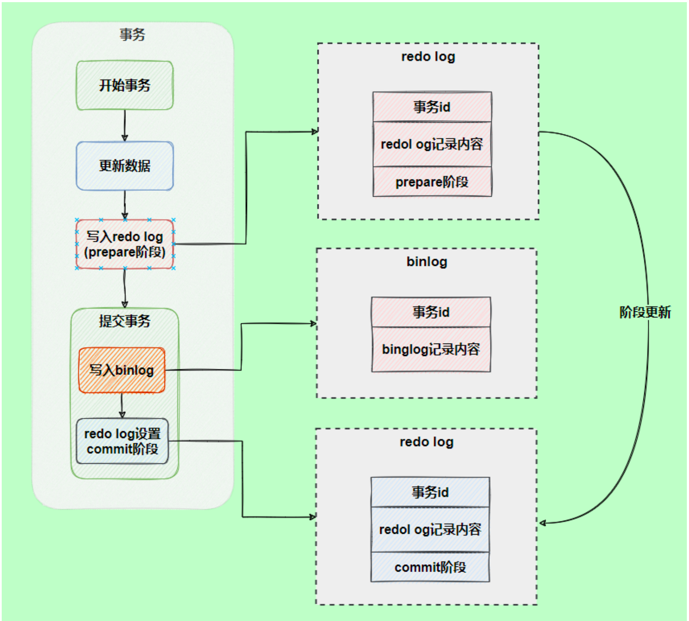

## 慢查询日志(slow query log)

记录所有执行时间超过 `long_query_time`的查询，方便对查询进行优化。

## 通用查询日志(general query log)

记录所有连接的起始时间和终止时间，以及连接发送给服务器的所有指令，对复原操作的实际场景、发现问题，甚至是对数据库操作的审计都有很大帮助。

```sql
-- 查看通用查询日志的状态
SHOW VARIABLES LIKE '%general%';
/*
+------------------+---------------------------------+
| Variable_name    | Value                           |
+------------------+---------------------------------+
| general_log      | OFF                             |  -- 通用查询日志处于关闭状态
| general_log_file | /var/lib/mysql/bc461f9ffb85.log |  -- 通用查询日志文件的路径
+------------------+---------------------------------+
*/
```

**启动日志**

方式1:

```ini
[mysqld]
general_log=ON
general_log_file=[path[filename]]
```

方式2:

```sql
SET GLOBAL general_log=ON;
```

**备份与刷新日志文件**

```bash
mv bc461f9ffb85.log bc461f9ffb85.log.back
mysqladmin -u root -p flush-logs
```

## 错误日志(error log)

记录MySQL服务的启动、运行或停止MySQL服务时出现的问题，方便了解服务器的状态，从而对服务器进行维护。

MySQL的错误日志默认开启，而且无法被禁用。

查看错误日志设置：

```sql
SHOW VARIABLES LIKE 'log_error%';
/*
+----------------------------+----------------------------------------+
| Variable_name              | Value                                  |
+----------------------------+----------------------------------------+
| log_error                  | /var/log/mysqd.log                                 |
| log_error_services         | log_filter_internal; log_sink_internal |
| log_error_suppression_list |                                        |
| log_error_verbosity        | 2                                      |
+----------------------------+----------------------------------------+
*/
```

修改错误日志路径（永久）：

```ini
[mysqld]
log-error=错误日志路径
```

备份与刷新日志文件

```bash
mv /var/log/mysqld.log /var/log/mysqld.log.back
mysqladmin -u root -p flush-logs

# 如果出错：
mv /var/log/mysqld.log /var/log/mysqld.log.back
install -omysql -gmysql -m0644 /dev/null /var/log/mysqld.log
mysqladmin -u root -p flush-logs
```


## 二进制日志(bin log)

记录所有更改数据的语句，可以用于主从服务器之间的数据同步，以及服务器遇到故障时数据的无损恢复。

主要应用场景：

- **数据恢复**：如果MYSQL数据库意外停止，可以通过二进制日志文件来查看用户执行了哪些操作，对数据库服务器文件做了哪些修改，然后根据二进制日志文件中的记录来恢复数据库服务器
- **数据复制**：由于日志的延续和时效性，master把它的二进制日志传递给slaves，来达到master-slave数据一致的目的

查看状态：

```sql
SHOW VARIABLES LIKE '%log_bin%';
/*
+---------------------------------+-----------------------------+
| Variable_name                   | Value                       |
+---------------------------------+-----------------------------+
| log_bin                         | ON                          |
| log_bin_basename                | /var/lib/mysql/binlog       |
| log_bin_index                   | /var/lib/mysql/binlog.index |
| log_bin_trust_function_creators | OFF                         |
| log_bin_use_v1_row_events       | OFF                         |
| sql_log_bin                     | ON                          |
+---------------------------------+-----------------------------+
*/
```

设置参数

```ini
[mysqld]
log-bin=log-basename-bin
binlog_expire_logs_seconds=600
max_binlog_size=100M
```

- `log-bin=XXX`：打开日志（主机需要打开），也可以自定义路径，比如 `log-bin=/var/mysql-bin/binlog`，（注意需要将该路径的所有者设置为运行mysql的用户和组）
- `binlog_expire_logs_seconds`：控制二进制日志文件保留的时长，单位是秒。默认 `2592000(30天)`。
- `max_binlog_size`：控制单个二进制日志文件大小，最大和默认值是`1G`。当前日志文件大小超过此变量时，执行切换操作，该设置**不能**严格控制binlog的大小。

> 数据库文件最好不要把日志文件放在一起

查看当前二进制文件列表及大小：

```sql
SHOW BINARY LOGS;
/*
+---------------+-----------+-----------+
| Log_name      | File_size | Encrypted |
+---------------+-----------+-----------+
| binlog.000001 |   3001484 | No        |
| binlog.000002 |       180 | No        |
| binlog.000003 |       180 | No        |
| binlog.000004 |     24482 | No        |
| binlog.000005 |     68284 | No        |
| binlog.000006 |     46101 | No        |
| binlog.000007 | 139026847 | No        |
| binlog.000008 | 624399223 | No        |
| binlog.000009 |     18382 | No        |
+---------------+-----------+-----------+
*/
```

查看binlog内容1（伪sql形式展现）

```bash
mysqlbinlog -v binlog.000009

#221018  7:59:11 server id 1  end_log_pos 2140 CRC32 0x13bbe79c 	Query	t
hread_id=8	exec_time=2	error_code=0	Xid = 48
SET TIMESTAMP=1666079951/*!*/;
CREATE INDEX idx_age_classid_name ON student(age,classId,name)
/*!*/;
# at 2140
```

查看binlog内容2

```sql
SHOW BINLOG EVENTS [IN '文件名'] [FROM 位置] [LIMIT [OFFSET,] row_count]

-- 举例
SHOW BINLOG EVENTS IN 'binlog.000009';
```

- `文件名`：指定要查询的binlog文件名，不指定就是第一个binlog文件
- `位置`：指定从哪个`pos` 起始点开始查起，不指定就从文件首个pos点开始
- `LIMIT OFFSET`：偏移量，不指定就是0
- `row_count`：查询总条数，不指定就全部

## 使用二进制日志恢复数据

```bash
mysqlbinlog [OPTION] filename | mysql -u root -p 密码
```

- `filename`：日志文件名
- `OPTION`可选项：
  - `--start-date ` 和 `--stop-date`：指定恢复数据的起始和结束时间
  - `--start-position`和`--stop-position`：指定恢复数据的开始位置和结束位置

## 删除二进制日志

部分删除：

```sql
PURGE {MASTER | BINARY} LOGS TO '日志文件名';
PURGE {MASTER | BINARY} LOGS BEFORE '指定日期';
```

全部删除：

```sql
RESET MASTER;
```

## BIN LOG和REDO LOG对比

- REDO LOG 是**物理日志**，记录内容是*在某个数据页上做了什么修改*，属于 INNODB 存储引擎层产生的
- BIN LOG 是**逻辑日志**，记录内容是语句的原始逻辑，属于 MySQL Server 层
- REDO LOG 让 INNODB 存储引擎有了崩溃恢复能力
- BIN LOG 保证了 MySQL 集群架构的数据一致性

## 两阶段提交

在执行写操作过程中，会记录 REDO LOG 和 BIN LOG两块日志，以基本的事务为单位，REDO LOG 在事务执行过程中可以不断写入，而BIN LOG只能在提交事务时才写入，所以两者的写入时机不一样。

两份日志之间的逻辑不一致，会出现什么问题？为了解决这个问题，INNODB存储引擎使用两阶段提交方案：将 REDO LOG 的写入拆成了两个步骤：prepare 和 commit。



使用两阶段提交后，写入BIN LOG时发生异常也不会有影响，因为MYSQL根据REDO LOG日志恢复数据时，发现REDO LOG还处于PREPARE阶段，并且没有对应的BIN LOG日志，就会回滚该事务。

## 中继日志(relay log)

用于主从服务器架构中，从服务器用来存放主服务器二进制日志内容的一个蹭文件。从服务器通过读取中继日志的内容，来同步主服务器上的操作。

文件名格式是 `从服务器名-relay-bin.序号`和一个索引文件`从服务器名-relay-bin.index`。

中继日志的格式和BIN LOG格式相同，可以使用 `mysqlbinlog` 工具进行查看。

###  恢复的典型错误

如果从服务器重装操作系统，可能导致服务器名称与之前不同，而中继日志里是包含服务器名的，这种情况下无法从之前的中继日志中恢复数据。重新设置服务器名即可。

## 数据定义语句日志

记录数据定义语句执行的元数据操作。

