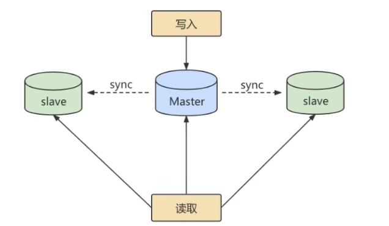
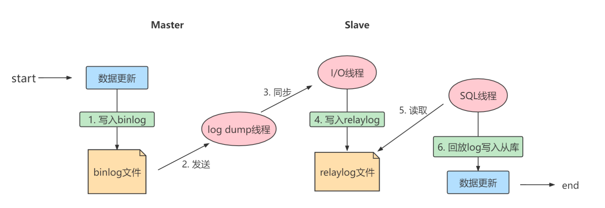
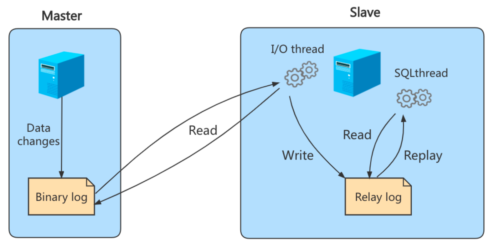
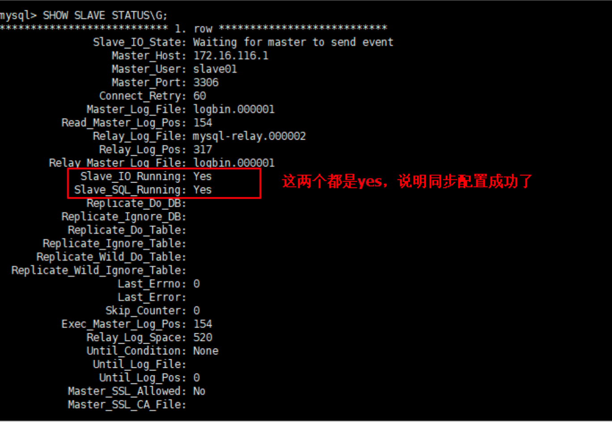

## 主从复制的作用

除了可以提高数据吞吐量之外，还有：

- 读写分离。可以通过主从复制的方式来同步数据，然后通过读写分离提高数据库并发处理能力

  

- 数据备份。通过主从复制将主库上的数据复制到从库上，相当于是一种热备份机制，也就是在主库正常运行的情况下进行备份，不影响到服务

- 具有高可用性。数据备份实际上是一种冗余的机制，通过这种方式可以换取数据库的高可用性，也就是当服务器出现故障或宕机的情况下，可以切换到从服务器上，保证服务的正常运行。

## 主从复制的原理

### 三个线程

实际上主从同步的原理就是基于BIN LOG进行数据同步的。在主从复制过程中，会基于3个线程来操作，一个主库线程，两个从库线程。



- 【主库】二进制日志转储线程(binlog dump thread)：当从库线程连接的时候，主库可以将二进制日志发送给从库，当主库读取事件的时候，会在BINLOG上加锁，读取完成之后，再将锁释放。
- 【从库】I/O线程：连接到主库，向主库发送请求更新BINLOG。这时从库的I/O线程就可以读取到主库的二进制日志转储线程发送的BINLOG更新部分，并且拷贝到本地的中继日志（RELAY LOG）。
- 【从库】SQL线程：读取从库中的中继日志，并执行日志中的事件，将从库中的数据与主库保持同步。

### 复制三步骤



- 步骤1: `Master` 将写操作记录到二进制日志
- 步骤2: `Slave`将`Master`  的 BINARY LOG EVENTS 拷贝到它的中继日志
- 步骤3:`Slave`重做中继日志中的事件，将改变应用到自己的数据库中。MYSQL复制是异步的，且串行化的，而且重启后从接入点开始复制

复制的问题：**延时**

### 复制的基本原则

- 每个 Slave 只有一个 Master
- 每个 Slave 只有有一个唯一的服务器ID
- 每个 Master 可以有多个 Slave

## 一主一从架构搭建

### 1. 主机配置文件

必选配置：

```ini
# 主服务器唯一ID
server-id=1
# 启用二进制日志，指明路径
log-bin=/var/mysql-bins/mysql-bin
```

可选配置：

```ini
# 0（默认）表示读写【主服务器】
# 1 表示只读【从服务器】
read-only=0
# 日志文件保留时长
binlog_expire_logs_seconds=6000
# 单个二进制日志文件大小，最大和默认值是1GB
max_binlog_size=200M
# 设置不要复制的数据库
binlog-ignore-db=test
# 设置需要复制的数据库，默认全部
binlog-do-db=需要复制的主数据库名称
# 设置BINLOG格式
binlog-format=STATEMENT
```

### 2. 从机配置文件

必选配置：

```ini
# 从服务器唯一ID
server-id=2
```

可选配置

```ini
# 启用中继日志
relay-log=mysql-relay
```

### 3. 主机：建立账户并授权

```sql
CREATE USER 'slave1'@'%' IDENTIFIED BY 'abc123';
GRANT REPLICATION SLAVE ON *.* TO 'slave1'@'%';
ALTER USER 'slave1'@'%' IDENTIFIED WITH mysql_native_password BY 'abc123';
FLUSH PRIVILEGES;
```

查询 Master 状态，并记录下 `File` 和 `Position` 的值

```sql
SHOW MASTER STATUS;
```

### 4. 从机：配置需要复制的主机

**步骤1**：从主机上复制主机的命令

```sql
CHANGE MASTER TO
MASTER_HOST='主机的IP地址',
MASTER_USER='主机用户名',
MASTER_PASSWORD='主机用户名的密码',
MASTER_LOG_FILE='mysql-bin.具体数字',
MASTER_LOG_POS=具体值;
```

举例：

```sql
CHANGE MASTER TO 
MASTER_HOST='192.168.1.110',
MASTER_USER='slave1',
MASTER_PASSWORD='abc123',
MASTER_SSL=0,
MASTER_LOG_FILE='mysql-bin.00007',
MASTER_LOG_POS=154;
```

**步骤2**：启动 Slave 同步

```sql
START SLAVE;
```

如果报错，删除之前的 relay_log，然后重新执行步骤1:

```sql
RESET SLAVE; -- 删除从库的中继日志文件
```

**步骤3**：查看同步状态

```sql
SHOW SLAVE STATUS\G
```

`Slave_IO_Running` 和 `Slave_SQL_Running` 都是 `Yes` 表示配置成功。



### 5. 测试

主机新建库、新建表，插入记录：

```sql
CREATE DATABASE atguigu_master_slave;
CREATE TABLE mytbl(id INT,NAME VARCHAR(16));
INSERT INTO mytbl VALUES(1, 'zhang3');
INSERT INTO mytbl VALUES(2,@@hostname);
```

从机复制，然后查看。

### 6. 停止主从同步

- 停止主 从同步

  ```sql
  STOP SLAVE;
  ```

### 7. 后续

## `binlog_format`

### `STATEMENT`

基于SQL语句的复制（Statement-base replication, SBR)。默认的BINLOG格式，每一条会修改数据的SQL语句都会记录到BINLOG中。

- 优点
  - 历史悠久，技术成熟
  - 不需要记录每一行的变化， 减少了BINLOG日志量，文件较小
  - BINLOG中包含了所有数据库更改信息，可以据此来审核数据库的安全等情况
  - BINLOG可以用于实时的还原，而不仅仅用于复制
  - 主从版本可以不一样，从服务器版本可比主服务器版本高
- 缺点
  - 不是所有UPDATE语句都能被复制，尤其是包含不确定操作的时候
  - 使用了以下函数的语句也无法被复制：`LOAD_FILE(), uuid(), USER(), FOUND_ROWS(), SYSDATE()(除非启动时启用了 --sysdate-is-now 选项)`
  - `INSERT...SELECT` 会产生比RBR更多的行级锁
  - 复制需要进行全表扫描（WHERE 语句中没有使用到索引）的UPDATE时，需要比RBR请求更多的行级锁
  - 对于有 AUTO _INCREMENT 字段的 INNODB而言，INSERT语句会阻塞其它INSERT语句
  - 对于一些复制的语句，在从服务器上的消耗资源情况会更严重，而RBR模式下，只会对那个发生变化的记录产生影响
  - 执行复杂语句如果出错，会消耗更多资源
  - 数据表必须几乎和主服务器保持一致才行，否则可能导致复制出错

### `ROW`

基于行的复制(Row-base replication, RBR)。不记录每条SQL语句的上下文信息，仅记录哪些数据被修改了，修改成什么样了

- 优点
  - 任何情况都可以被复制，这对复制来说是最安全可靠的
  - 多数情况下，从服务器上的表如果有主键的话，复制会快很多
  - 复制以下语句时的行锁更少：`INSER...SELECT`、包含`AUTO_INCREMENT`字段的INSERT、没有附带条件或者并没有修改很多记录的UPDATE或DELETE语句
  - 执行INSERT、UPDATE、DELETE语句时锁更少
  - 从服务器上采用多线程来执行复制成为可能
- 缺点
  - BINLOG大了很多
  - 复杂的回滚时BINLOG会包含大量的数据
  - 主服务器上执行UPDATE语句时，所有发生变化的记录都会写到BINLOG中，而SBR只会写一次，这会发到频繁发生BINLOG的并发写问题
  - 无法从BILOG中看到都复制了什么语句

### `MIXED`

混合模式(mixed-base replication, MBR)。SBR和RBR的结合。

一般的语句修改使用SBR保存BINLOG。诸如某些函数等，SBR无法完成的操作，则采用RBR。

MYSQL会根据执行的每一条具体的SQL在SBR和RBR之间选择。

## 同步数据一致性问题

